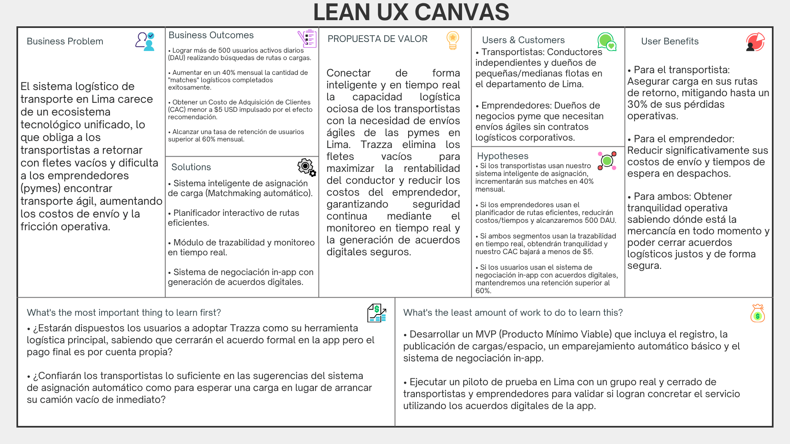

## 1.2. Solution Profile

### 1.2.1. Antecedentes y problemática

**Técnica 5W2H**

Para comprender la raíz y el impacto de la problemática de los fletes vacíos en el sector logístico, aplicamos la técnica de las 5 'W's y 2 'H's:

* **Who (Quién):** El problema lo padecen de forma directa los transportistas independientes que llevan carga y los empresarios dueños de flotas de camiones, conformando ambos nuestros principales segmentos objetivo.

* **What (Qué):** Los vehículos de transporte de carga se ven obligados a realizar sus viajes de retorno completamente vacíos tras finalizar una entrega.

* **Where (Dónde):** El alcance geográfico de esta problemática se experimenta a nivel del departamento de Lima.

* **When (Cuándo):** Ocurre sistemáticamente en la actualidad, justo en el momento en que inicia el trayecto de regreso, generando en el conductor la frustración de estar realizando un viaje improductivo.

* **Why (Por qué):** Surge por la alta complejidad logística que implica coordinar a un vendedor cerca del punto de entrega inicial con un comprador cercano al destino final, agravado por la ausencia de una red de contactos sólida.

* **How (Cómo):** En la actualidad, los afectados intentan mitigar la situación buscando contactos de manera rudimentaria fuera de marcos tecnológicos; sin embargo, en la gran mayoría de los casos, el problema simplemente se ignora y se asume la pérdida.

* **How Much (Cuánto):** A pesar de existir un ligero ahorro de combustible al viajar sin carga, la ineficiencia representa una pérdida aproximada del 30% de rentabilidad. Además, este modelo genera un incremento innecesario en la huella de carbono y encarece significativamente los precios finales de los productos en el mercado.

**Descripción de los antecedentes**

**Enunciado del Problema**

Los transportistas y empresarios de flotas en el departamento de Lima enfrentan una pérdida de hasta el 30% en su rentabilidad y generan una excesiva huella de carbono debido a la alta complejidad logística y la falta de herramientas tecnológicas para conectar con redes de contactos confiables que les permitan aprovechar sus viajes de retorno (fletes vacíos).

**Descripción de la problemática**

**Puntos Clave a Resolver**

* **Reducción de la fricción logística:** Automatizar el emparejamiento entre transportistas con capacidad disponible y usuarios que necesitan enviar carga.

* **Digitalización de la red de contactos:** Trasladar la búsqueda rudimentaria de oportunidades a un ecosistema tecnológico centralizado y accesible.

* **Optimización operativa y ambiental:** Maximizar la productividad de cada viaje, mitigando el impacto económico en los precios de los productos y reduciendo la emisión innecesaria de carbono.

**Objetivos**

* Diseñar e implementar una plataforma digital que conecte eficientemente la oferta y demanda de fletes en Lima.

* Trazar rutas precisas en tiempo real para optimizar el recorrido logístico entre los puntos de recojo y entrega.

**Restricciones y Alcance**

* **Gestión de Pagos:** La plataforma no actuará como pasarela de pagos. No se procesarán transacciones económicas entre clientes, transportistas, vendedores o compradores; la negociación financiera se realizará estrictamente por fuera del sistema.

* **Conectividad:** Es un requisito indispensable contar con conexión a internet ininterrumpida para acceder a la red de proveedores y compradores.

* **Geolocalización:** El sistema requiere obligatoriamente tener la ubicación del dispositivo activada para el trazado de rutas y seguimiento en tiempo real.

**Propuesta Tecnológica (Trazza)**

Para hacer frente a esta problemática, StackRoot presenta **Trazza**, una plataforma logística inteligente estructurada sobre una arquitectura en la nube de AWS. El sistema está desarrollado con un backend robusto en Java, Spring Boot, y un frontend web dinámico en TypeScript con el framework Angular.

El núcleo logístico de Trazza se potencia mediante algoritmos computacionales de optimización como Backtracking, Dijkstra, TSP y BFS, para evaluar capacidades de peso, trazar rutas eficientes y generar matrices de costos.

A nivel de escalabilidad, el producto integrará motores de Inteligencia Artificial avanzada para automatizar el emparejamiento (*matchmaking*) entre compradores y vendedores, analizando variables históricas y de proximidad para asignar la carga ideal al camión adecuado sin esfuerzo manual.

Y también, Trazza contempla la integración de ecosistemas IoT en las flotas para monitorear el estado físico de la carga en tránsito junto a un sistema de seguimiento GPS por hardware que garantiza la trazabilidad continua del vehículo y la mercancía, incluso en trayectos donde la conexión a internet sea intermitente.

### 1.2.2. Lean UX Process

#### 1.2.2.1. Lean UX Problem Statements

El estado actual de **el sistema logístico de transporte de carga en Lima** se ha enfocado principalmente en **transportistas independientes y pequeños emprendedores que coordinan despachos de forma manual, padeciendo de alta complejidad logística y retornos con fletes vacíos.** Lo que los productos y servicios existentes no abordan es **la falta de un ecosistema tecnológico unificado y automatizado que conecte la demanda urgente con la capacidad ociosa de los vehículos en tiempo real.** Nuestro producto abordará esta brecha mediante **un sistema inteligente de asignación de carga y planificación de rutas que conecte la oferta y la demanda sin intermediación de pagos.** Nuestro enfoque inicial será **el sector de transportistas independientes, dueños de flotas y pymes en el departamento de Lima.** Sabremos que tenemos éxito cuando veamos **un incremento del 40% en emparejamientos exitosos mensuales, la reducción del tiempo promedio de asignación a menos de 15 minutos, y la recuperación de hasta un 30% de rentabilidad operativa en nuestro público objetivo durante el primer trimestre.**

#### 1.2.2.2. Lean UX Assumptions

**1. Business Assumptions**
* Creemos que existe una alta viabilidad en el mercado local para soluciones logísticas digitales, ya que la informalidad actual genera pérdidas económicas que los transportistas buscan mitigar urgentemente.
* Creemos que nuestra posición en el mercado será altamente competitiva al adoptar un modelo de negocio que no cobra comisiones por transacciones, actuando puramente como un facilitador.
* Creemos que nuestras capacidades organizativas y de marketing nos permitirán establecer alianzas estratégicas con gremios de transporte para la adquisición inicial de usuarios.

**2. Business Outcome Assumptions**
* Creemos que lograremos **más de 500 usuarios activos diarios (DAU)** buscando rutas o cargas en la plataforma durante el primer trimestre.
* Creemos que **aumentará en un 40% mensual** la cantidad de "matches" logísticos completados exitosamente.
* Creemos que obtendremos un **costo de adquisición de clientes (CAC) menor a $5 USD** gracias al efecto red y la recomendación boca a boca.
* Creemos que lograremos una **tasa de retención de usuarios superior al 60% mensual** al facilitarles un entorno de negociación seguro y directo.

**3. User Assumptions**
* Creemos que un segmento clave son los dueños de flotas y transportistas independientes que buscan maximizar la rentabilidad de cada viaje, especialmente en los retornos.
* Creemos que nuestro otro segmento principal son los emprendedores y dueños de negocios pyme que necesitan envíos ágiles y no cuentan con contratos fijos en empresas de logística tradicionales.
* Creemos que ambos perfiles de usuarios interactuarán con el sistema principalmente a través de dispositivos móviles durante su jornada laboral, a menudo en entornos de conectividad variable.

**4. User Outcome and Benefit Assumptions**
* Creemos que los transportistas lograrán el objetivo de asegurar carga para sus rutas de retorno, obteniendo el beneficio de mitigar hasta un 30% de pérdidas económicas.
* Creemos que los emprendedores pyme lograrán encontrar transporte confiable rápidamente, obteniendo el beneficio de reducir drásticamente sus costos de envío y tiempos de espera.
* Creemos que ambos usuarios lograrán realizar transacciones seguras, obteniendo la tranquilidad de saber dónde está la mercancía en todo momento mediante trazabilidad.
* Creemos que ambos usuarios lograrán negociar términos justos de manera directa, obteniendo el beneficio de cerrar acuerdos logísticos de forma rápida y a conveniencia mutua.

**5. Feature Assumptions**
* Creemos que implementaremos un **Sistema inteligente de asignación de carga (Matchmaking automático)** para conectar la carga disponible con el vehículo ideal según capacidad y ubicación.
* Creemos que implementaremos un **Planificador interactivo de rutas eficientes** para calcular las distancias y los trayectos más rentables.
* Creemos que integraremos un **Módulo de trazabilidad y monitoreo en tiempo real** para garantizar el seguimiento de la carga durante todo el viaje.
* Creemos que habilitaremos un **Sistema de negociación in-app con generación de acuerdos digitales** para que las partes fijen sus tarifas de forma segura, añadiendo valor a la plataforma y evitando tratos informales externos.

#### 1.2.2.3. Lean UX Hypothesis Statements

**Hipótesis 1**
Creemos que lograremos **un aumento del 40% mensual en la cantidad de matches logísticos completados** si **los transportistas independientes y dueños de flotas** logran **asegurar carga para sus rutas de retorno y mitigar pérdidas económicas** con el **Sistema inteligente de asignación de carga (Matchmaking automático)**.

**Hipótesis 2**
Creemos que lograremos **más de 500 usuarios activos diarios (DAU)** si **los emprendedores y dueños de negocios pyme** logran **reducir sus costos de envío y tiempos de espera** con el **Planificador interactivo de rutas eficientes**.

**Hipótesis 3**
Creemos que lograremos **un costo de adquisición de clientes (CAC) menor a $5 USD por el efecto recomendación** si **ambos perfiles de usuarios** logran **la tranquilidad de saber dónde está su mercancía en todo momento** con el **Módulo de trazabilidad y monitoreo en tiempo real**.

**Hipótesis 4**
Creemos que lograremos **una tasa de retención de usuarios superior al 60% mensual** si **ambos perfiles de usuarios** logran **negociar acuerdos logísticos de forma rápida y a conveniencia mutua** con el **Sistema de negociación in-app con generación de acuerdos digitales**.

#### 1.2.2.4. Lean UX Canvas

En el siguiente gráfico se consolida el proceso estratégico a través del Lean UX Canvas de Trazza. Este lienzo resume visualmente el problema central, los beneficios esperados para nuestros segmentos objetivo (transportistas y emprendedores), las soluciones propuestas y las hipótesis fundamentales del proyecto.

  
   
  <em>Figura: Lean UX Canvas de Trazza. Elaboración propia.</em>

> Lean UX Canvas: [https://canva.link/41xql8grxyjm2m8](https://canva.link/41xql8grxyjm2m8)