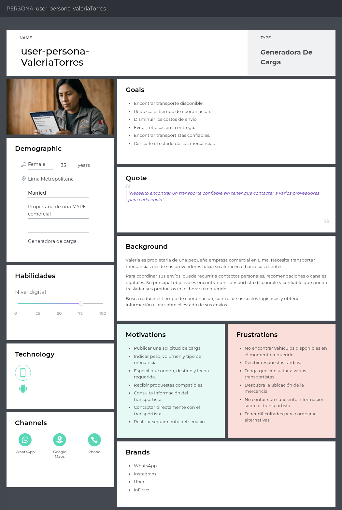

## 2.3. Needfinding
El Needfinding es una actividad fundamental de la ingeniería de requisitos que permite identificar las necesidades, problemas, expectativas y actividades de los usuarios antes de definir las funcionalidades del sistema. En el proyecto Trazza, esta etapa busca comprender cómo los transportistas y las MYPE generan, buscan y coordinan servicios de transporte actualmente.
Para ello, se emplean herramientas de análisis centradas en el usuario, como User Personas, User Task Matrix, User Journey Mapping, Empathy Mapping y As-is Scenario Mapping. Estos artefactos permiten reconocer dificultades del proceso actual y establecer oportunidades de mejora que servirán como base para la definición de requisitos funcionales y no funcionales de la plataforma.

### 2.3.1 User Personas
A continuación, se presentan los arquetipos de nuestros segmentos objetivos. La construcción de estos User Personas se basó directamente en la información recolectada durante las entrevistas, tomando en cuenta las principales frustraciones, motivaciones y el nivel de digitalización de los usuarios. Además, se consideró el análisis de la competencia para identificar qué carencias actuales en el mercado podrían ser resueltas para estos perfiles. Cada ficha incluye información demográfica, metas, marcas afines y su principal problemática logística.

#### User Persona del Segmento Objetivo 1: Transportistas de Carga Terrestre

> User Persona - Juan David Ramos: [https://uxpressia.com/w/v8FzI/p/7Mes0](https://uxpressia.com/w/v8FzI/p/7Mes0)

 

#### User Persona del Segmento Objetivo 2: Pequeños y Medianos Emprendedores

> User Persona - Valeria Torres: [https://uxpressia.com/w/v8FzI/p/tzGKz](https://uxpressia.com/w/v8FzI/p/tzGKz)

 

### 2.3.2 User Task Matrix
En esta sección se presenta el User Task Matrix, el cual concentra las tareas clave que los representantes de cada segmento (Transportistas y Emprendedores MYPE) realizan para cumplir sus objetivos logísticos. Estas tareas reflejan las actividades del mundo real que se ejecutan independientemente de nuestra futura solución de software.

> User Task Matrix: [https://canva.link/ublc7myvirh3hob](https://canva.link/ublc7myvirh3hob)

**Análisis de tareas:**
Al comparar ambos perfiles, observamos que las tareas con mayor frecuencia e importancia para el Emprendedor MYPE son la "Búsqueda de transportistas" y el "Monitoreo del envío", dado que de ello depende la satisfacción de su cliente final. Por su parte, para el Transportista, la "Búsqueda de carga de retorno" y la "Negociación de tarifas" son críticas, ya que impactan directamente en su rentabilidad. 
Una coincidencia importante es que ambos segmentos dedican mucho esfuerzo a la "Coordinación de tiempos y recojo". La principal diferencia radica en el enfoque de seguridad: el emprendedor teme por el estado de su mercadería, mientras que el transportista teme la informalidad del pago o asaltos en ruta.

 

### 2.3.3 User Journey Mapping
A continuación se presentan las versiones As-Is de los User Journey Maps, es decir, el recorrido actual que experimenta cada usuario para lograr su objetivo sin la existencia de nuestra plataforma. Para el Transportista, se ilustra el viaje desde que finaliza un servicio hasta que intenta conseguir una carga de retorno para no viajar vacío. Para el Emprendedor MYPE, se ilustra el proceso desde que recibe un pedido hasta que logra coordinar y verificar la entrega del mismo.

#### User Persona 1: Juan David Ramos

> User Journey Map - Juan David Ramos: [https://uxpressia.com/w/v8FzI/m/1H5VY](https://uxpressia.com/w/v8FzI/m/1H5VY)

 

#### User Persona 2: Valeria Torres

> User Journey Map - Valeria Torres: [https://uxpressia.com/w/v8FzI/m/rEbN7](https://uxpressia.com/w/v8FzI/m/rEbN7)

 

### 2.3.4 Empathy Mapping
Para la elaboración de estos Empathy Maps, el equipo analizó las respuestas y el lenguaje corporal de los usuarios durante las entrevistas. Colocando al User Persona en el centro, mapeamos sus percepciones respondiendo a: ¿Qué está diciendo y haciendo en su día a día?, ¿Qué escucha de sus colegas o clientes?, y ¿Qué ve en su entorno laboral? Posteriormente, identificamos sus *Pains* (frustraciones por procesos manuales, pérdida de dinero, inseguridad) y sus *Gains* (lo que esperan lograr y cómo una solución tecnológica podría convencerlos al resolver sus problemas).

#### User Persona 1: Juan David Ramos

> Empathy Map - Juan David Ramos: [https://uxpressia.com/w/v8FzI/p/K9mve](https://uxpressia.com/w/v8FzI/p/K9mve)

 

#### User Persona 2: Valeria Torres

> Empathy Map - Valeria Torres: [https://uxpressia.com/w/v8FzI/p/SQmML](https://uxpressia.com/w/v8FzI/p/SQmML)
