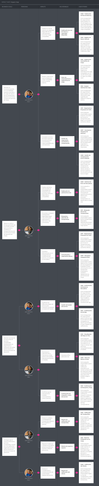

### 3.2. Impact Mapping

El Impact Mapping es una técnica visual y estratégica de planificación que conecta los objetivos del negocio digital con las características del producto de software a través de los actores y los comportamientos esperados. Permite alinear el desarrollo hacia la entrega de valor real, asegurando que cada funcionalidad implementada responda a una meta estratégica clara.

A continuación, se presenta el Impact Map unificado de Trazza, el cual articula los Business Goals (definidos bajo criterios SMART), los actores identificados a partir de los User Personas (Juan David Ramos y Valeria Torres), los impactos esperados en su comportamiento, los entregables (deliverables) de la plataforma y su posterior descomposición en historias de usuario:

> Impact Mapping: [https://uxpressia.com/w/v8FzI/i/yOY8J](https://uxpressia.com/w/v8FzI/i/yOY8J)