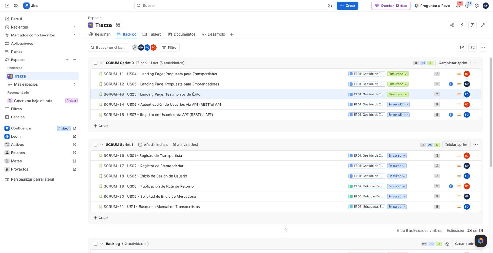

## 3.3. Product Backlog

A continuación se presenta el Product Backlog del proyecto, ordenado según el valor de negocio que aporta cada funcionalidad. Se ha priorizado el flujo principal de generación de valor (Landing Page, Publicación de Carga, Búsqueda y Emparejamiento) por encima de las tareas estrictamente técnicas o de configuración de perfiles, garantizando así un enfoque centrado en el usuario y en la viabilidad del negocio logístico.

La estimación de esfuerzo se ha realizado utilizando *Story Points* basados en la serie de Fibonacci (1, 2, 3, 5, 8), considerando la complejidad técnica, la incertidumbre y el esfuerzo requerido para cada User Story.

| # Orden | User Story Id | Título | Descripción | Story Points |
|---|---|---|---|---|
| 1 | **US04** | Landing Page: Propuesta para Transportistas | Como visitante del segmento Transportista quiero visualizar los beneficios de la aplicación en el sitio web estático para comprender cómo me ayuda a rentabilizar mis viajes vacíos. | 2 |
| 2 | **US05** | Landing Page: Propuesta para Emprendedores | Como visitante del segmento Emprendedor quiero identificar cómo la plataforma asegura mis envíos en el sitio web estático para decidir registrarme con total confianza. | 2 |
| 3 | **US25** | Landing Page: Testimonios de Éxito | Como visitante del segmento Emprendedor quiero leer testimonios de otros usuarios en el sitio web estático para validar la credibilidad de la plataforma. | 2 |
| 4 | **US08** | Publicación de Ruta de Retorno | Como transportista de carga terrestre quiero publicar mi ruta de regreso y la capacidad disponible de mi vehículo para recibir solicitudes de carga compatibles. | 5 |
| 5 | **US09** | Solicitud de Envío de Mercadería | Como pequeño o mediano emprendedor quiero solicitar el envío de mis productos especificando peso y destino para encontrar transportistas con espacio libre en dicha ruta. | 5 |
| 6 | **US10** | Sugerencias Automáticas de Carga | Como transportista de carga terrestre quiero recibir sugerencias automáticas de carga compatibles con mi ruta de retorno para no viajar con el flete vacío. | 5 |
| 7 | **US11** | Búsqueda Manual de Transportistas | Como pequeño emprendedor quiero buscar transportistas disponibles especificando fechas y rutas para elegir la mejor opción. | 5 |
| 8 | **US12** | Aceptar Solicitud de Carga | Como transportista de carga terrestre quiero aceptar una solicitud de carga sugerida para asegurar el viaje de retorno. | 5 |
| 9 | **US27** | Cancelación Temprana de Solicitud | Como pequeño emprendedor quiero poder cancelar mi solicitud de viaje antes del recojo de mercadería para anular la operación si tengo un imprevisto de última hora. | 5 |
| 10 | **US13** | Negociación y Propuesta de Tarifa | Como pequeño emprendedor quiero proponer una tarifa por el envío al transportista para llegar a un acuerdo económico directo. | 5 |
| 11 | **US29** | Mensajería Integrada (Chat) | Como pequeño emprendedor quiero disponer de un canal de chat integrado en la plataforma para comunicarme con el transportista emparejado y coordinar rápidamente los pormenores del recojo. | 8 |
| 12 | **US15** | Visualización de Ubicación en Vivo | Como pequeño emprendedor quiero ver la ubicación de mi mercadería en tiempo real para tener tranquilidad durante el traslado. | 8 |
| 13 | **US16** | Confirmación de Recojo de Mercadería | Como transportista de carga terrestre quiero marcar en la aplicación cuando haya recogido la carga para iniciar formalmente el monitoreo del viaje. | 5 |
| 14 | **US17** | Confirmación de Entrega | Como transportista de carga terrestre quiero confirmar que la mercadería ha sido entregada en el destino para finalizar el viaje y habilitar las calificaciones. | 5 |
| 15 | **US30** | Alerta de Desvío en Ruta | Como pequeño emprendedor quiero recibir una notificación automática si el camión se desvía más de 2 kilómetros de la ruta planificada para estar alerta ante posibles riesgos o retrasos. | 8 |
| 16 | **US31** | Confirmación de Recepción y Pago | Como pequeño emprendedor quiero confirmar la recepción conforme de la mercadería desde mi aplicación para validar el servicio y procesar el abono del flete correspondiente. | 8 |
| 17 | **US01** | Registro de Transportista | Como transportista de carga terrestre quiero registrar mis datos personales y los de mi vehículo en la plataforma para poder ofrecer mi disponibilidad en rutas de retorno. | 3 |
| 18 | **US02** | Registro de Emprendedor | Como pequeño o mediano emprendedor quiero registrar los datos de mi empresa en la plataforma para poder buscar transportistas disponibles y coordinar envíos de mercadería. | 3 |
| 19 | **US03** | Inicio de Sesión de Usuario | Como usuario registrado quiero iniciar sesión utilizando mis credenciales para acceder a las funcionalidades correspondientes a mi perfil. | 3 |
| 20 | **US26** | Validación de Identidad (KYC) | Como administrador del sistema quiero requerir y validar el DNI de los transportistas durante su registro para garantizar un ecosistema seguro y confiable para los emprendedores. | 8 |
| 21 | **US28** | Gestión de Compensación (Lucro Cesante) | Como transportista de carga terrestre quiero recibir una compensación económica si el cliente cancela un viaje cuando ya me encuentro en ruta, para resarcir los gastos generados (lucro cesante). | 8 |
| 22 | **US19** | Calificación del Transportista | Como pequeño emprendedor quiero calificar de 1 a 5 estrellas al transportista tras finalizar un viaje para ayudar a construir su reputación en la plataforma. | 2 |
| 23 | **US20** | Calificación del Cliente | Como transportista de carga terrestre quiero calificar al emprendedor (cliente) según su nivel de cumplimiento y trato para alertar a otros conductores. | 2 |
| 24 | **US21** | Reportar Problemas con la Carga | Como pequeño emprendedor quiero poder reportar un problema si mi mercadería llega dañada o incompleta para que la plataforma tome acciones de soporte. | 2 |
| 25 | **US23** | Registro de Nuevo Vehículo | Como transportista de carga terrestre quiero añadir los datos de un nuevo camión a mi perfil (dimensiones, capacidad) para poder asignarlo a diferentes viajes. | 3 |
| 26 | **US24** | Historial de Envíos | Como pequeño emprendedor quiero visualizar el historial de mis envíos pasados para llevar un control de mis operaciones logísticas. | 5 |
| 27 | **US06** | Autenticación de Usuarios vía API (RESTful API) | Como Developer quiero un servicio de autenticación que valide credenciales y entregue un token para proteger de forma segura las rutas privadas de la API. | 5 |
| 28 | **US07** | Registro de Usuarios vía API (RESTful API) | Como Developer quiero un servicio de registro de nuevos usuarios que cifre las contraseñas antes de almacenarlas para garantizar la seguridad de la información en la base de datos. | 5 |
| 29 | **US14** | Consulta de Rutas Disponibles vía API (RESTful API) | Como Developer quiero un servicio de consulta que devuelva las rutas de retorno disponibles filtradas por origen y destino para mostrar los resultados en la aplicación cliente. | 5 |
| 30 | **US18** | Registro de Ubicación GPS vía API (RESTful API) | Como Developer quiero un servicio que reciba y actualice constantemente las coordenadas GPS de un viaje en curso para alimentar el seguimiento en vivo. | 5 |
| 31 | **US22** | Registro de Calificaciones vía API (RESTful API) | Como Developer quiero un servicio para registrar las calificaciones entre usuarios y recalcular el promedio general del perfil afectado. | 5 |

> Jira Product Backlog: [https://trazza.atlassian.net/jira/software/projects/SCRUM/boards/1/backlog?atlOrigin=eyJpIjoiNGVmMmVmN2MxM2VlNDY4NmI5ODdjZjllY2JlMzY2ZjkiLCJwIjoiaiJ9](https://trazza.atlassian.net/jira/software/projects/SCRUM/boards/1/backlog?atlOrigin=eyJpIjoiNGVmMmVmN2MxM2VlNDY4NmI5ODdjZjllY2JlMzY2ZjkiLCJwIjoiaiJ9)
