## 4.3. Landing Page UI Design.

En esta sección se presenta la propuesta de diseño de interfaz de usuario para el landing page de Trazza en sus versiones desktop y mobile. El objetivo es materializar las decisiones de arquitectura de la información y los lineamientos visuales en una experiencia digital clara, estructurada y orientada a resolver la problemática de los fletes vacíos en Lima Metropolitana.

A través de este diseño, se busca captar la atención de nuestros segmentos objetivo y guiarlos de manera progresiva desde el primer impacto visual hasta la conversión final, asegurando una interacción intuitiva en cada etapa del recorrido.

### 4.3.1. Landing Page Wireframe.

Explicación para Desktop

  
  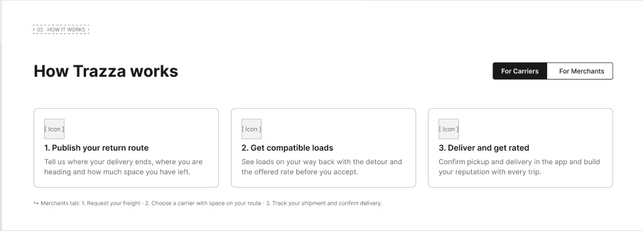
  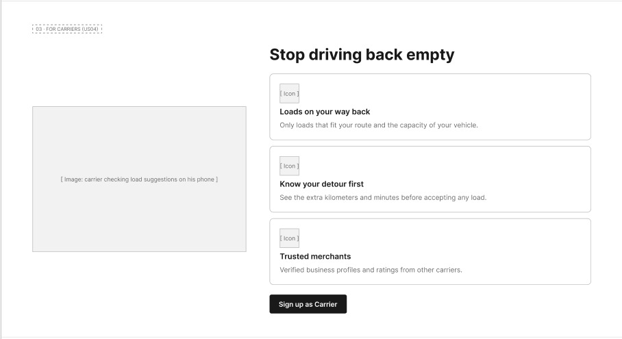
  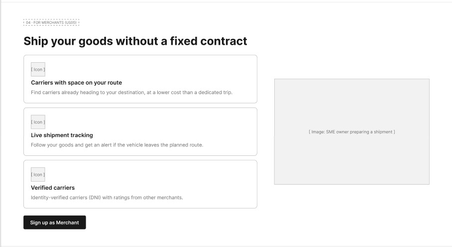
  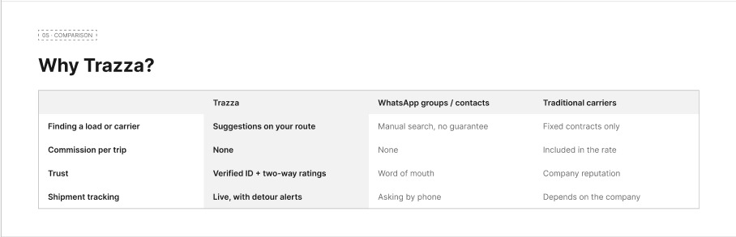
  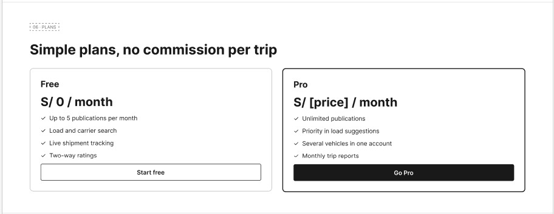
  
  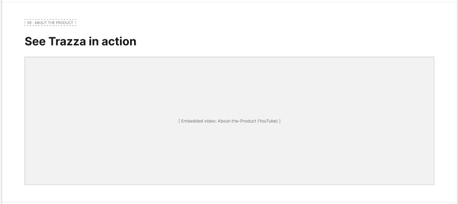
  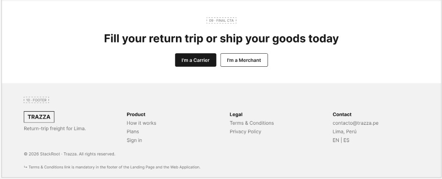

El diseño esquemático de la versión de escritorio está estructurado para guiar al usuario a través de un recorrido ordenado y persuasivo. Al abrir la página, se muestra una barra superior con el logotipo de Trazza, enlaces directos a las secciones principales y dos botones de llamada a la acción segmentados para transportistas y emprendedores. En el bloque principal se ubica el título enfocado en la logística inversa y la reducción de pérdidas operativas, junto con un espacio reservado para visualizar la ruta y el mapa.

A medida que el usuario baja en la página, encuentra la sección de funcionamiento en tres pasos detallados, seguida de dos bloques de beneficios segmentados por rol: uno dirigido a emprendedores (merchants), que destaca el ahorro en envíos y la trazabilidad de su carga, y otro dirigido a transportistas (carriers), que resalta el aprovechamiento de los retornos vacíos, el motor de IA y el monitoreo por GPS. Más abajo se incluye una tabla comparativa frente a los métodos tradicionales e informales, la sección de planes con las alternativas de suscripción disponibles y las tarjetas con casos de éxito de usuarios reales en Lima. Finalmente, la página presenta un bloque reservado para el video demostrativo del servicio y cierra con un pie de página corporativo que reúne los enlaces legales, de soporte y contacto.

Explicación para Mobile

  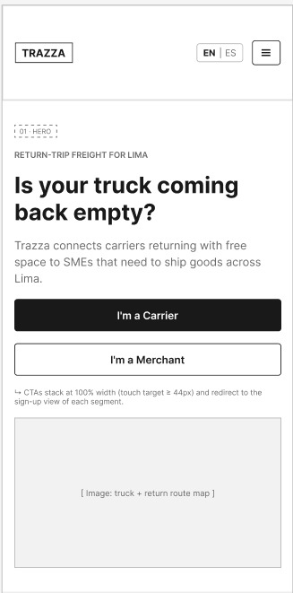
  
  
  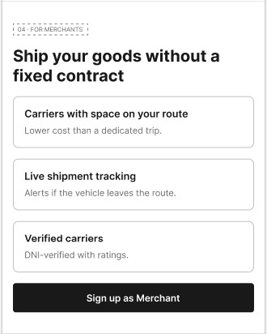
  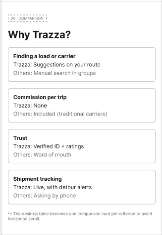
  
  
  
  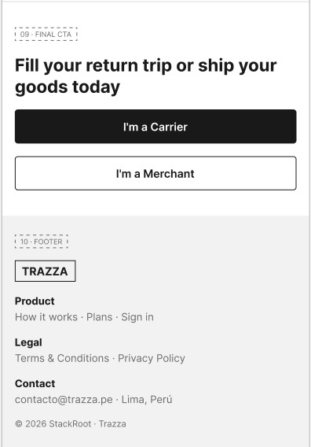

El wireframe de la versión móvil conserva el mismo orden de contenidos que la versión de escritorio, pero lo reorganiza en un layout de una sola columna pensado para pantallas de 390px. La barra de navegación se resume en el logotipo y un menú colapsable, mientras que los botones de llamada a la acción para transportistas y emprendedores se apilan verticalmente para facilitar su pulsación. Los pasos de funcionamiento, los bloques de beneficios para merchants y carriers, la tabla comparativa, los planes y los testimonios se transforman en tarjetas apiladas que se recorren con un desplazamiento vertical continuo, terminando con el espacio del video y un pie de página compacto.

---

### 4.3.2. Landing Page Mock-up.

Explicación para Desktop

  
  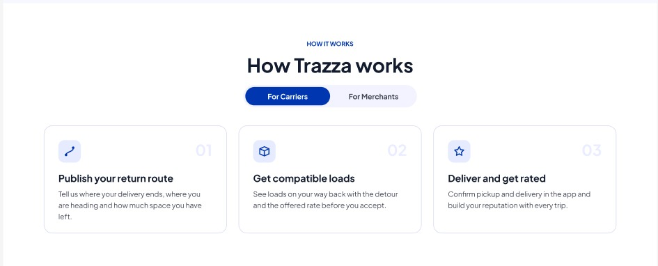
  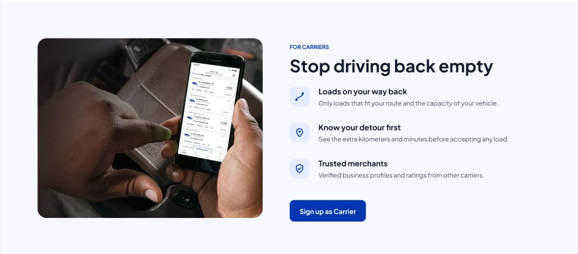
  
  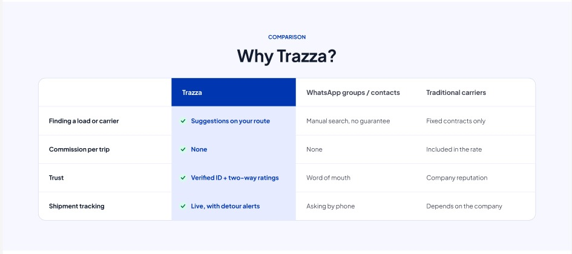
  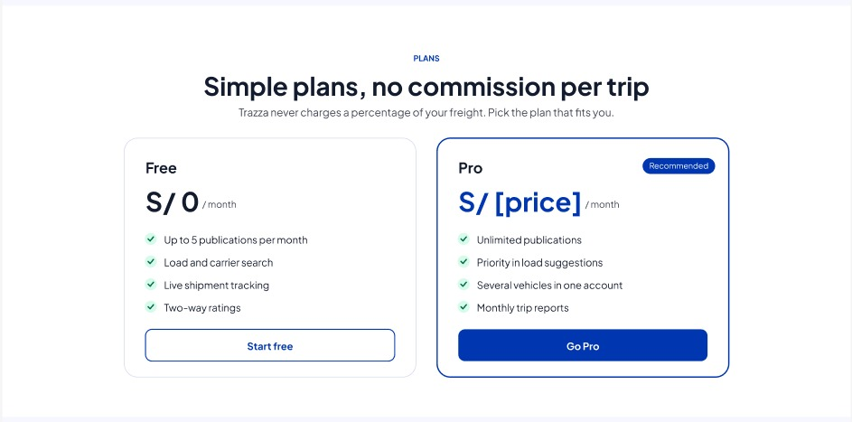
  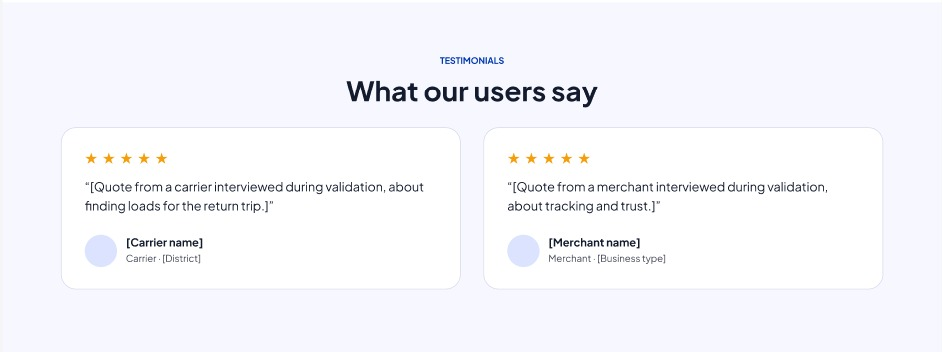
  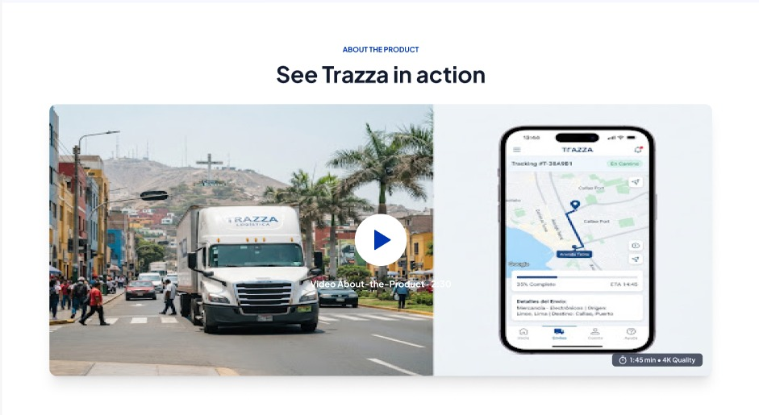
  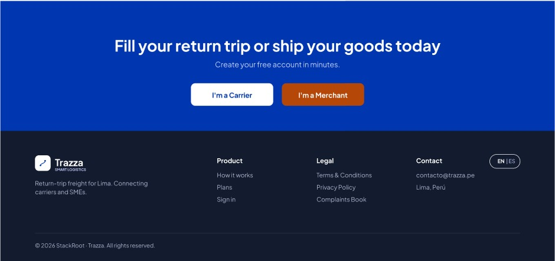

El diseño visual de la landing page aplica los lineamientos del Design System de Trazza, utilizando la paleta de colores corporativa y una tipografía limpia y legible. La interfaz inicia con el bloque principal que integra un panel interactivo de rastreo en tiempo real, acompañado de los accesos rápidos y métricas de confianza que respaldan la propuesta de valor de la plataforma.

En las siguientes secciones se muestran de forma visual el flujo operativo en tres pasos y los beneficios diferenciados para emprendedores y transportistas, cada uno con iconografía y tarjetas propias que refuerzan la segmentación por rol. A continuación se presentan la tabla comparativa de mercado con sus respectivos contrastes, la sección de planes con las características de cada alternativa y las opiniones de transportistas y emprendedores. El recorrido finaliza con un bloque con la demostración en video del motor de emparejamiento y el pie de página institucional, asegurando una experiencia profesional y orientada por completo a la conversión.

Explicación para Mobile

  
  
  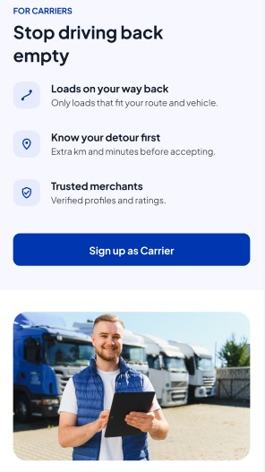
  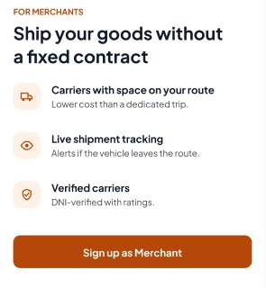
  
  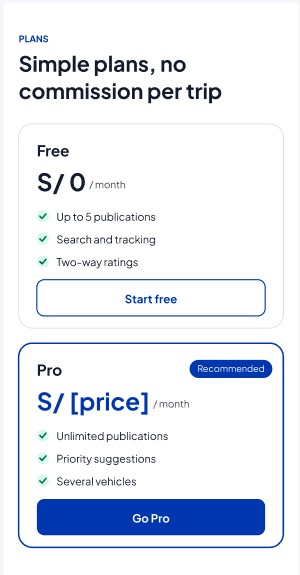
  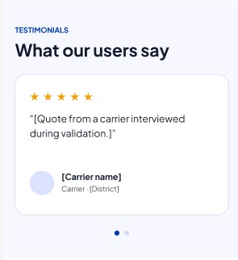
  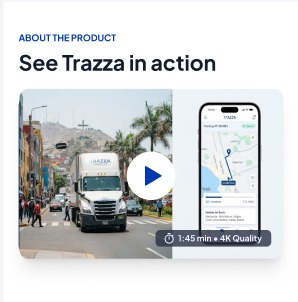
  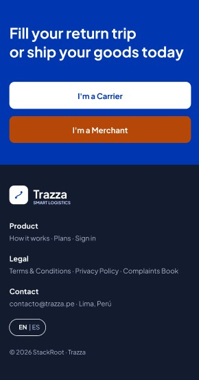

La adaptación móvil de los mockups reorganiza la estructura en una interfaz fluida a una sola columna, priorizando elementos táctiles de fácil acceso, menús desplegables optimizados y tarjetas compactas que garantizan una lectura ágil para transportistas y emprendedores directamente desde sus smartphones. Los bloques de beneficios por rol, la tabla comparativa y los planes se presentan en tarjetas verticales que mantienen la jerarquía visual de la versión de escritorio sin sacrificar legibilidad.
