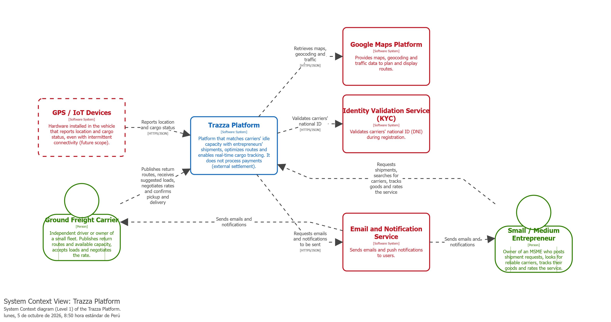
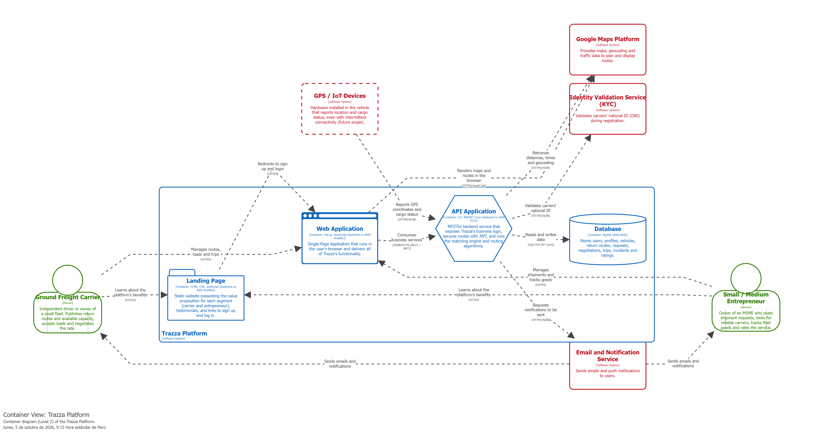
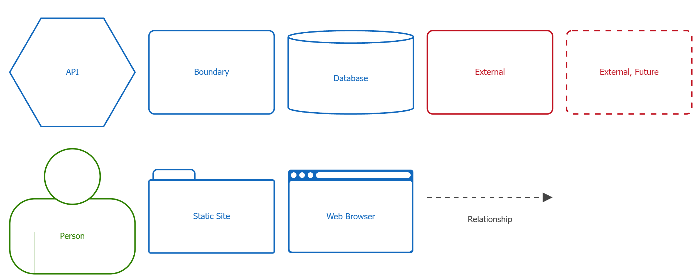
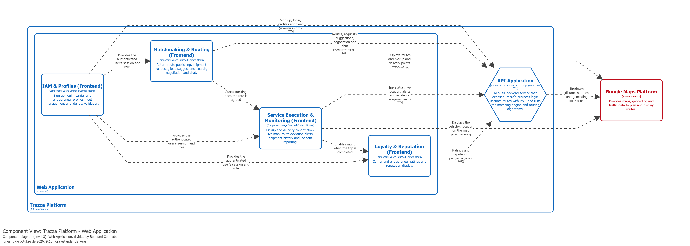
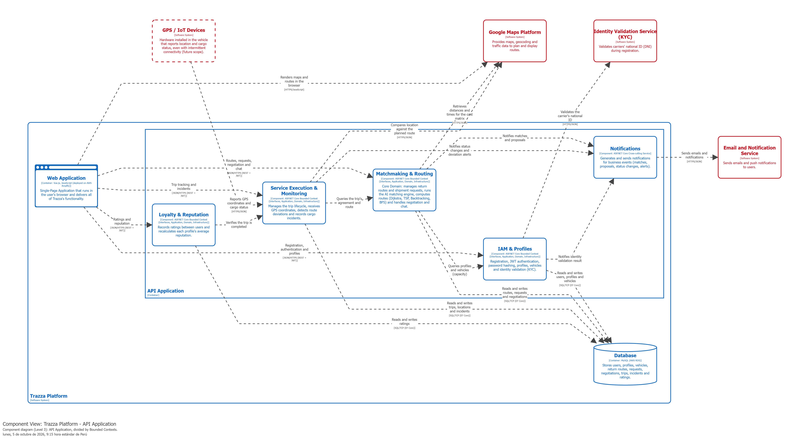

# 4.6. Domain-Driven Software Architecture

## 4.6.1. Design-Level Event Storming

> *Fuente: Elaboración propia. Ver **Anexo F – Event Storming Completo** para el tablero interactivo completo en Figma.*

A continuación se detallan las entidades principales de Trazza, organizadas por Bounded Context, distinguiendo cuáles actúan como Raíz de Agregado (Aggregate Root) y cuáles son entidades hijas o Value Objects asociados:

### 1. Contexto: IAM & Perfiles (Identity & Profile Management)
- **Usuario (Aggregate Root):**
- **PerfilTransportista (Entidad / Aggregate Root):**
- **Vehiculo (Entidad dentro del agregado o Aggregate Root de Flota):**
- **PerfilEmprendedor (Entidad / Aggregate Root):**

### 2. Contexto: Matchmaking & Routing (Core Domain)
- **RutaRetorno (Aggregate Root):**
- **SolicitudEnvio (Aggregate Root):**
- **PropuestaMatch / Negociacion (Aggregate Root):**

### 3. Contexto: Service Execution & Monitoring (IoT & Tránsito)
- **ViajeLogistico / Shipment (Aggregate Root):**
- **Incidencia (Entidad hija dentro de ViajeLogistico):**

### 4. Contexto: Payment & Billing (Pagos)
- **TransaccionPago (Aggregate Root):**
- **Comprobante (Entidad / Aggregate Root):**

### 5. Contexto: Loyalty & Reputation (Calificaciones)
- **Calificacion (Aggregate Root):**

## 4.6.2. Software Architecture Context Diagram

A continuación se presenta el **Context Diagram** (Nivel 1), el cual ilustra de manera global la interacción de Trazza Platform con sus actores y sistemas externos.

**Diagram key**

## 4.6.3. Software Architecture Container Diagrams

Haciendo un acercamiento, el **Container diagram** (Nivel 2) detalla las aplicaciones principales que conforman el sistema y cómo se comunican entre sí.

**Diagram key**

## 4.6.4. Software Architecture Components Diagrams

A continuación se detalla la arquitectura interna de los dos contenedores principales de la plataforma Trazza, ilustrando cómo las responsabilidades se distribuyen a nivel de código fuente.

### 4.6.4.1. Frontend Web Application Components

**Diagram key**

### 4.6.4.2. API Application Components (Matchmaking Core)

**Diagram key**

