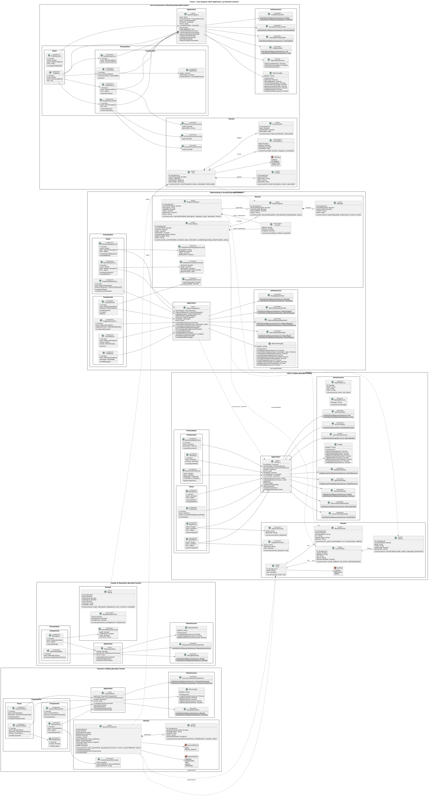
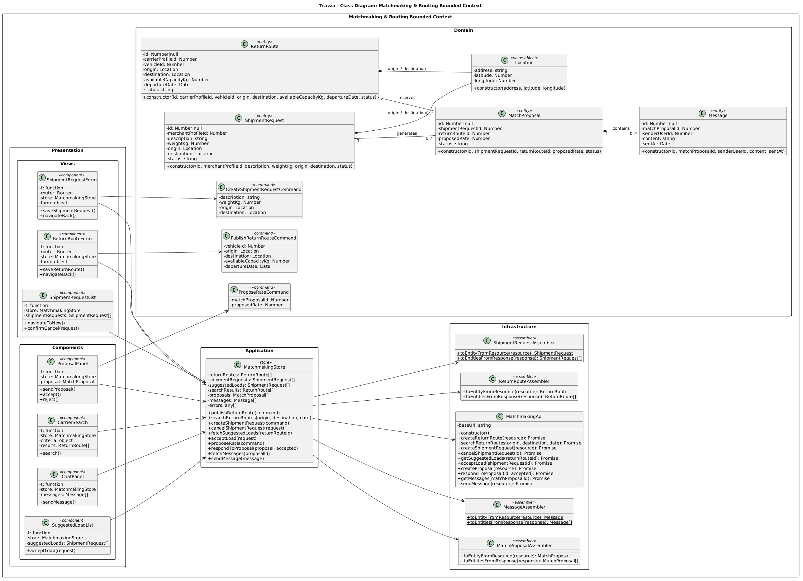
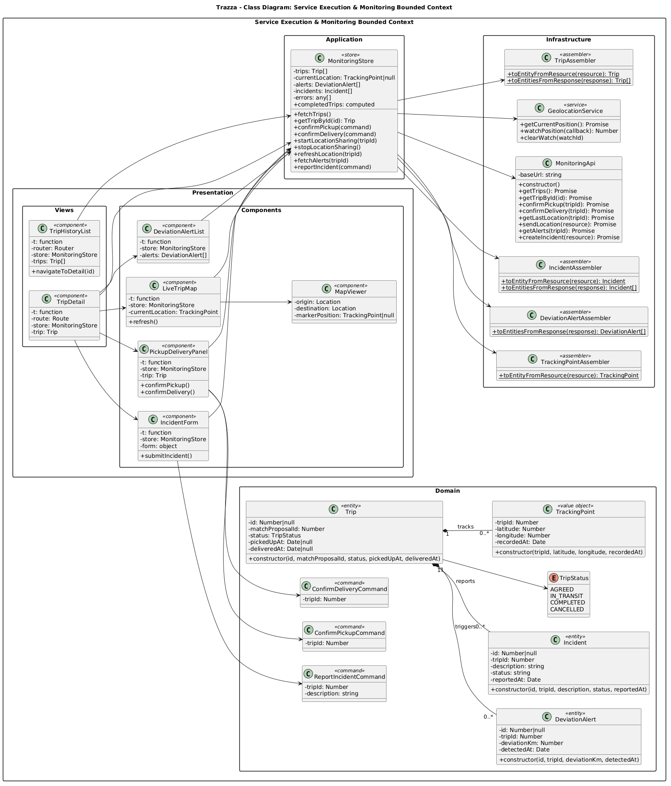
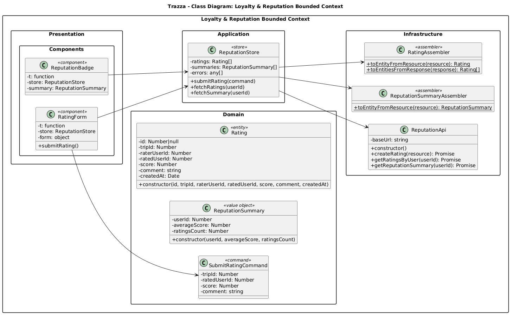
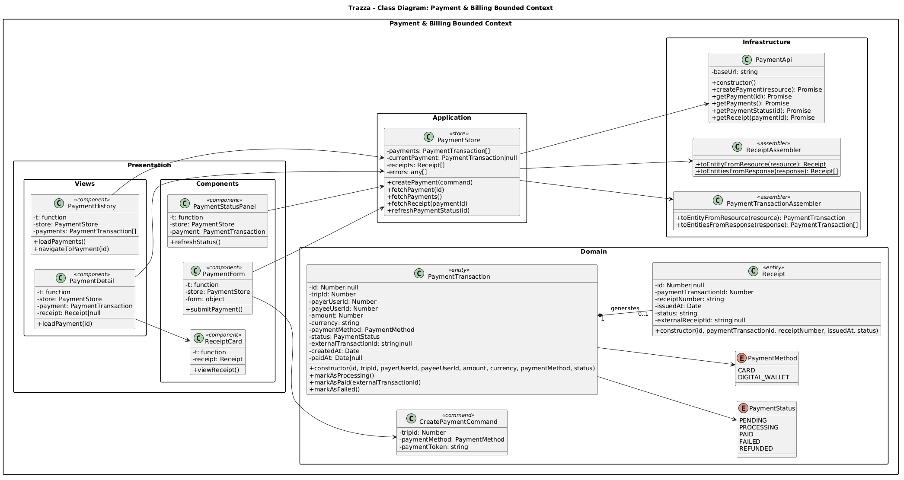

## 4.7. Software Object-Oriented Design

En esta sección se presenta el diseño orientado a objetos de Trazza, considerando los principios de Domain-Driven Design (DDD) definidos para la arquitectura del sistema. El diseño de clases representa las principales entidades, objetos de valor, servicios y componentes de las capas Domain, Application, Infrastructure y Presentation.

La estructura del diseño se organiza de acuerdo con los bounded contexts identificados para la plataforma: IAM & Profiles, Matchmaking & Routing, Service Execution & Monitoring, Payment & Billing y Loyalty & Reputation. Esta organización permite mantener separadas las responsabilidades de cada contexto y representar las relaciones existentes entre los principales elementos del dominio.

Asimismo, se presenta el Class Dictionary, donde se detallan los atributos, tipos de datos, métodos y responsabilidades de las principales clases del sistema.

### 4.7.1. Class Diagrams

**IAM & Profiles** 

**Matchmaking & Routing** 

**Service Execution & Monitoring** 

**Loyalty & Reputation**

**Payment & Billing**  

### 4.7.2. Class Dictionary
A continuación se presenta el diccionario de clases en formato markdown, organizado por bounded context. Para cada clase se indican su capa y estereotipo, sus atributos con sus tipos y sus métodos con una breve descripción. Los constructores no se listan.
 
#### IAM & Profiles Bounded Context
 
##### UserRole
 
*Capa: Domain · Estereotipo: enum*
 
| Valores | Descripción |
|---|---|
| CARRIER | Transportista de carga terrestre. |
| MERCHANT | Pequeño o mediano emprendedor. |
| ADMIN | Administrador del sistema. |
 
##### User
 
*Capa: Domain · Estereotipo: entity*
 
| Atributos | Tipos |
|---|---|
| id | Number\|null |
| email | string |
| role | UserRole |
 
##### CarrierProfile
 
*Capa: Domain · Estereotipo: entity*
 
| Atributos | Tipos |
|---|---|
| id | Number\|null |
| userId | Number |
| fullName | string |
| dni | string |
| phone | string |
| identityValidated | boolean |
 
##### MerchantProfile
 
*Capa: Domain · Estereotipo: entity*
 
| Atributos | Tipos |
|---|---|
| id | Number\|null |
| userId | Number |
| businessName | string |
| ruc | string |
| businessType | string |
| address | string |
 
##### Vehicle
 
*Capa: Domain · Estereotipo: entity*
 
| Atributos | Tipos |
|---|---|
| id | Number\|null |
| carrierProfileId | Number |
| plate | string |
| model | string |
| capacityKg | Number |
| dimensions | string |
 
##### SignInCommand
 
*Capa: Domain · Estereotipo: command*
 
| Atributos | Tipos |
|---|---|
| email | string |
| password | string |
 
##### SignUpCommand
 
*Capa: Domain · Estereotipo: command*
 
| Atributos | Tipos |
|---|---|
| email | string |
| password | string |
| role | UserRole |
 
##### SignInResource
 
*Capa: Infrastructure · Estereotipo: resource*
 
| Atributos | Tipos |
|---|---|
| id | Number |
| email | string |
| role | string |
| token | string |
 
##### SignUpResource
 
*Capa: Infrastructure · Estereotipo: resource*
 
| Atributos | Tipos |
|---|---|
| message | string |
 
##### UserAssembler
 
*Capa: Infrastructure · Estereotipo: assembler*
 
| Métodos | Descripción |
|---|---|
| `toEntityFromResource(resource): User` | Convierte un recurso recibido de la API en una entidad de dominio User. |
| `toEntitiesFromResponse(response): User[]` | Convierte la respuesta de la API (lista de recursos) en una lista de entidades User. |
 
##### CarrierProfileAssembler
 
*Capa: Infrastructure · Estereotipo: assembler*
 
| Métodos | Descripción |
|---|---|
| `toEntityFromResource(resource): CarrierProfile` | Convierte un recurso recibido de la API en una entidad de dominio CarrierProfile. |
 
##### MerchantProfileAssembler
 
*Capa: Infrastructure · Estereotipo: assembler*
 
| Métodos | Descripción |
|---|---|
| `toEntityFromResource(resource): MerchantProfile` | Convierte un recurso recibido de la API en una entidad de dominio MerchantProfile. |
 
##### VehicleAssembler
 
*Capa: Infrastructure · Estereotipo: assembler*
 
| Métodos | Descripción |
|---|---|
| `toEntityFromResource(resource): Vehicle` | Convierte un recurso recibido de la API en una entidad de dominio Vehicle. |
| `toEntitiesFromResponse(response): Vehicle[]` | Convierte la respuesta de la API (lista de recursos) en una lista de entidades Vehicle. |
 
##### SignInAssembler
 
*Capa: Infrastructure · Estereotipo: assembler*
 
| Métodos | Descripción |
|---|---|
| `toResourceFromResponse(response): SignInResource` | Convierte la respuesta de la API en un recurso SignInResource. |
 
##### SignUpAssembler
 
*Capa: Infrastructure · Estereotipo: assembler*
 
| Métodos | Descripción |
|---|---|
| `toResourceFromResponse(response): SignUpResource` | Convierte la respuesta de la API en un recurso SignUpResource. |
 
##### IamApi
 
*Capa: Infrastructure*
 
| Atributos | Tipos |
|---|---|
| baseUrl | string |
 
| Métodos | Descripción |
|---|---|
| `signIn(signInRequest): Promise` | Envía las credenciales al endpoint de inicio de sesión y retorna la respuesta con el token JWT. |
| `signUp(signUpRequest): Promise` | Envía los datos de registro al endpoint de creación de cuenta. |
| `getCarrierProfile(userId): Promise` | Obtiene el perfil de transportista asociado a un usuario. |
| `getMerchantProfile(userId): Promise` | Obtiene el perfil de emprendedor asociado a un usuario. |
| `updateProfile(resource): Promise` | Actualiza los datos del perfil del usuario. |
| `getVehicles(carrierProfileId): Promise` | Obtiene los vehículos registrados por un transportista. |
| `createVehicle(resource): Promise` | Registra un nuevo vehículo en el perfil de un transportista. |
| `validateIdentity(resource): Promise` | Envía el DNI y el documento del transportista al servicio de validación de identidad (KYC). |
 
##### authenticationGuard
 
*Capa: Infrastructure · Estereotipo: guard*
 
| Métodos | Descripción |
|---|---|
| `authenticationGuard(to, from): object\|boolean` | Protege las rutas privadas: permite la navegación solo si hay una sesión activa y redirige al inicio de sesión en caso contrario. |
 
##### iamInterceptor
 
*Capa: Infrastructure · Estereotipo: interceptor*
 
| Métodos | Descripción |
|---|---|
| `iamInterceptor(config): AxiosRequestConfig` | Adjunta el token JWT de la sesión actual a cada solicitud HTTP saliente. |
 
##### IamStore
 
*Capa: Application · Estereotipo: store*
 
| Atributos | Tipos |
|---|---|
| currentUser | User\|null |
| carrierProfile | CarrierProfile\|null |
| merchantProfile | MerchantProfile\|null |
| vehicles | Vehicle[] |
| errors | any[] |
| isSignedIn | boolean |
| currentToken | computed |
| currentRole | computed |
 
| Métodos | Descripción |
|---|---|
| `signIn(signInCommand, router)` | Autentica al usuario, guarda el token y el rol de la sesión y redirige a su pantalla principal. |
| `signUp(signUpCommand, router)` | Registra una nueva cuenta con su rol y redirige al inicio de sesión. |
| `signOut()` | Cierra la sesión, elimina el token y limpia los datos del usuario. |
| `fetchProfile()` | Carga el perfil de transportista o de emprendedor según el rol del usuario. |
| `updateProfile(profile)` | Actualiza el perfil del usuario y refresca el estado local. |
| `fetchVehicles()` | Carga la lista de vehículos del transportista autenticado. |
| `addVehicle(vehicle)` | Registra un nuevo vehículo y lo agrega a la lista local. |
| `validateIdentity(document)` | Envía el documento de identidad para su validación y actualiza el estado de validación del perfil. |
 
##### AuthenticationSection
 
*Capa: Presentation · Estereotipo: component*
 
| Atributos | Tipos |
|---|---|
| router | Router |
| store | IamStore |
| isSignedIn | computed |
| currentRole | computed |
 
| Métodos | Descripción |
|---|---|
| `performSignOut()` | Cierra la sesión del usuario y redirige a la pantalla de inicio de sesión. |
 
##### VehicleList
 
*Capa: Presentation · Estereotipo: component*
 
| Atributos | Tipos |
|---|---|
| t | function |
| store | IamStore |
| vehicles | Vehicle[] |
 
| Métodos | Descripción |
|---|---|
| `navigateToNew()` | Navega al formulario de registro de un nuevo vehículo. |
 
##### IdentityValidationForm
 
*Capa: Presentation · Estereotipo: component*
 
| Atributos | Tipos |
|---|---|
| t | function |
| store | IamStore |
| document | File\|null |
 
| Métodos | Descripción |
|---|---|
| `submitDocument()` | Envía el documento de identidad seleccionado para su validación. |
 
##### SignInForm
 
*Capa: Presentation · Estereotipo: component*
 
| Atributos | Tipos |
|---|---|
| router | Router |
| store | IamStore |
| form | object |
 
| Métodos | Descripción |
|---|---|
| `performSignIn()` | Valida el formulario y solicita el inicio de sesión al store. |
 
##### SignUpForm
 
*Capa: Presentation · Estereotipo: component*
 
| Atributos | Tipos |
|---|---|
| router | Router |
| store | IamStore |
| form | object |
 
| Métodos | Descripción |
|---|---|
| `performSignUp()` | Valida el formulario y solicita el registro de la cuenta al store. |
 
##### ProfileView
 
*Capa: Presentation · Estereotipo: component*
 
| Atributos | Tipos |
|---|---|
| t | function |
| store | IamStore |
| profile | CarrierProfile\|MerchantProfile |
 
| Métodos | Descripción |
|---|---|
| `saveProfile()` | Guarda los cambios realizados en el perfil. |
 
##### VehicleForm
 
*Capa: Presentation · Estereotipo: component*
 
| Atributos | Tipos |
|---|---|
| t | function |
| store | IamStore |
| form | object |
 
| Métodos | Descripción |
|---|---|
| `saveVehicle()` | Valida los datos del vehículo y solicita su registro. |
| `navigateBack()` | Regresa a la lista de vehículos. |
 
#### Matchmaking & Routing Bounded Context
 
##### Location
 
*Capa: Domain · Estereotipo: value object*
 
| Atributos | Tipos |
|---|---|
| address | string |
| latitude | Number |
| longitude | Number |
 
##### ReturnRoute
 
*Capa: Domain · Estereotipo: entity*
 
| Atributos | Tipos |
|---|---|
| id | Number\|null |
| carrierProfileId | Number |
| vehicleId | Number |
| origin | Location |
| destination | Location |
| availableCapacityKg | Number |
| departureDate | Date |
| status | string |
 
##### ShipmentRequest
 
*Capa: Domain · Estereotipo: entity*
 
| Atributos | Tipos |
|---|---|
| id | Number\|null |
| merchantProfileId | Number |
| description | string |
| weightKg | Number |
| origin | Location |
| destination | Location |
| status | string |
 
##### MatchProposal
 
*Capa: Domain · Estereotipo: entity*
 
| Atributos | Tipos |
|---|---|
| id | Number\|null |
| shipmentRequestId | Number |
| returnRouteId | Number |
| proposedRate | Number |
| status | string |
 
##### Message
 
*Capa: Domain · Estereotipo: entity*
 
| Atributos | Tipos |
|---|---|
| id | Number\|null |
| matchProposalId | Number |
| senderUserId | Number |
| content | string |
| sentAt | Date |
 
##### PublishReturnRouteCommand
 
*Capa: Domain · Estereotipo: command*
 
| Atributos | Tipos |
|---|---|
| vehicleId | Number |
| origin | Location |
| destination | Location |
| availableCapacityKg | Number |
| departureDate | Date |
 
##### CreateShipmentRequestCommand
 
*Capa: Domain · Estereotipo: command*
 
| Atributos | Tipos |
|---|---|
| description | string |
| weightKg | Number |
| origin | Location |
| destination | Location |
 
##### ProposeRateCommand
 
*Capa: Domain · Estereotipo: command*
 
| Atributos | Tipos |
|---|---|
| matchProposalId | Number |
| proposedRate | Number |
 
##### ReturnRouteAssembler
 
*Capa: Infrastructure · Estereotipo: assembler*
 
| Métodos | Descripción |
|---|---|
| `toEntityFromResource(resource): ReturnRoute` | Convierte un recurso recibido de la API en una entidad de dominio ReturnRoute. |
| `toEntitiesFromResponse(response): ReturnRoute[]` | Convierte la respuesta de la API (lista de recursos) en una lista de entidades ReturnRoute. |
 
##### ShipmentRequestAssembler
 
*Capa: Infrastructure · Estereotipo: assembler*
 
| Métodos | Descripción |
|---|---|
| `toEntityFromResource(resource): ShipmentRequest` | Convierte un recurso recibido de la API en una entidad de dominio ShipmentRequest. |
| `toEntitiesFromResponse(response): ShipmentRequest[]` | Convierte la respuesta de la API (lista de recursos) en una lista de entidades ShipmentRequest. |
 
##### MatchProposalAssembler
 
*Capa: Infrastructure · Estereotipo: assembler*
 
| Métodos | Descripción |
|---|---|
| `toEntityFromResource(resource): MatchProposal` | Convierte un recurso recibido de la API en una entidad de dominio MatchProposal. |
| `toEntitiesFromResponse(response): MatchProposal[]` | Convierte la respuesta de la API (lista de recursos) en una lista de entidades MatchProposal. |
 
##### MessageAssembler
 
*Capa: Infrastructure · Estereotipo: assembler*
 
| Métodos | Descripción |
|---|---|
| `toEntityFromResource(resource): Message` | Convierte un recurso recibido de la API en una entidad de dominio Message. |
| `toEntitiesFromResponse(response): Message[]` | Convierte la respuesta de la API (lista de recursos) en una lista de entidades Message. |
 
##### MatchmakingApi
 
*Capa: Infrastructure*
 
| Atributos | Tipos |
|---|---|
| baseUrl | string |
 
| Métodos | Descripción |
|---|---|
| `createReturnRoute(resource): Promise` | Publica una nueva ruta de retorno con su capacidad disponible. |
| `searchReturnRoutes(origin, destination, date): Promise` | Busca rutas de retorno disponibles por origen, destino y fecha. |
| `createShipmentRequest(resource): Promise` | Crea una solicitud de envío de mercadería. |
| `cancelShipmentRequest(id): Promise` | Cancela una solicitud de envío antes del recojo. |
| `getSuggestedLoads(returnRouteId): Promise` | Obtiene las cargas sugeridas compatibles con una ruta de retorno. |
| `acceptLoad(shipmentRequestId): Promise` | Registra la aceptación de una carga sugerida por parte del transportista. |
| `createProposal(resource): Promise` | Envía una propuesta de tarifa para una solicitud en negociación. |
| `respondToProposal(id, accepted): Promise` | Acepta o rechaza una propuesta de tarifa. |
| `getMessages(matchProposalId): Promise` | Obtiene los mensajes del chat de una negociación. |
| `sendMessage(resource): Promise` | Envía un mensaje en el chat de una negociación. |
 
##### MatchmakingStore
 
*Capa: Application · Estereotipo: store*
 
| Atributos | Tipos |
|---|---|
| returnRoutes | ReturnRoute[] |
| shipmentRequests | ShipmentRequest[] |
| suggestedLoads | ShipmentRequest[] |
| searchResults | ReturnRoute[] |
| proposals | MatchProposal[] |
| messages | Message[] |
| errors | any[] |
 
| Métodos | Descripción |
|---|---|
| `publishReturnRoute(command)` | Publica una ruta de retorno y la agrega a la lista local. |
| `searchReturnRoutes(origin, destination, date)` | Busca transportistas con capacidad en la ruta indicada y guarda los resultados. |
| `createShipmentRequest(command)` | Crea una solicitud de envío y la agrega a la lista local. |
| `cancelShipmentRequest(request)` | Cancela una solicitud de envío y actualiza su estado local. |
| `fetchSuggestedLoads(returnRouteId)` | Carga las cargas sugeridas para una ruta de retorno. |
| `acceptLoad(request)` | Acepta una carga sugerida y cambia la solicitud al estado "En negociación". |
| `proposeRate(command)` | Envía una propuesta de tarifa al transportista. |
| `respondToProposal(proposal, accepted)` | Acepta o rechaza una propuesta de tarifa y actualiza su estado. |
| `fetchMessages(proposalId)` | Carga los mensajes de una negociación. |
| `sendMessage(message)` | Envía un mensaje y lo agrega a la conversación local. |
 
##### SuggestedLoadList
 
*Capa: Presentation · Estereotipo: component*
 
| Atributos | Tipos |
|---|---|
| t | function |
| store | MatchmakingStore |
| suggestedLoads | ShipmentRequest[] |
 
| Métodos | Descripción |
|---|---|
| `acceptLoad(request)` | Solicita al store aceptar la carga seleccionada. |
 
##### ProposalPanel
 
*Capa: Presentation · Estereotipo: component*
 
| Atributos | Tipos |
|---|---|
| t | function |
| store | MatchmakingStore |
| proposal | MatchProposal |
 
| Métodos | Descripción |
|---|---|
| `sendProposal()` | Envía una propuesta de tarifa. |
| `accept()` | Acepta la propuesta de tarifa recibida. |
| `reject()` | Rechaza la propuesta de tarifa recibida. |
 
##### ChatPanel
 
*Capa: Presentation · Estereotipo: component*
 
| Atributos | Tipos |
|---|---|
| t | function |
| store | MatchmakingStore |
| messages | Message[] |
 
| Métodos | Descripción |
|---|---|
| `sendMessage()` | Envía el mensaje escrito al otro participante de la negociación. |
 
##### CarrierSearch
 
*Capa: Presentation · Estereotipo: component*
 
| Atributos | Tipos |
|---|---|
| t | function |
| store | MatchmakingStore |
| criteria | object |
| results | ReturnRoute[] |
 
| Métodos | Descripción |
|---|---|
| `search()` | Busca transportistas disponibles con los criterios de origen, destino y fecha. |
 
##### ReturnRouteForm
 
*Capa: Presentation · Estereotipo: component*
 
| Atributos | Tipos |
|---|---|
| t | function |
| router | Router |
| store | MatchmakingStore |
| form | object |
 
| Métodos | Descripción |
|---|---|
| `saveReturnRoute()` | Valida el formulario y publica la ruta de retorno. |
| `navigateBack()` | Regresa a la pantalla anterior. |
 
##### ShipmentRequestForm
 
*Capa: Presentation · Estereotipo: component*
 
| Atributos | Tipos |
|---|---|
| t | function |
| router | Router |
| store | MatchmakingStore |
| form | object |
 
| Métodos | Descripción |
|---|---|
| `saveShipmentRequest()` | Valida el formulario y crea la solicitud de envío. |
| `navigateBack()` | Regresa a la pantalla anterior. |
 
##### ShipmentRequestList
 
*Capa: Presentation · Estereotipo: component*
 
| Atributos | Tipos |
|---|---|
| t | function |
| store | MatchmakingStore |
| shipmentRequests | ShipmentRequest[] |
 
| Métodos | Descripción |
|---|---|
| `navigateToNew()` | Navega al formulario de nueva solicitud de envío. |
| `confirmCancel(request)` | Solicita confirmación y cancela la solicitud seleccionada. |
 
#### Service Execution & Monitoring Bounded Context
 
##### TripStatus
 
*Capa: Domain · Estereotipo: enum*
 
| Valores | Descripción |
|---|---|
| AGREED | Tarifa acordada, pendiente de recojo. |
| IN_TRANSIT | Mercadería recogida y en traslado. |
| COMPLETED | Entrega confirmada. |
| CANCELLED | Viaje cancelado. |
 
##### Trip
 
*Capa: Domain · Estereotipo: entity*
 
| Atributos | Tipos |
|---|---|
| id | Number\|null |
| matchProposalId | Number |
| status | TripStatus |
| pickedUpAt | Date\|null |
| deliveredAt | Date\|null |
 
##### TrackingPoint
 
*Capa: Domain · Estereotipo: value object*
 
| Atributos | Tipos |
|---|---|
| tripId | Number |
| latitude | Number |
| longitude | Number |
| recordedAt | Date |
 
##### DeviationAlert
 
*Capa: Domain · Estereotipo: entity*
 
| Atributos | Tipos |
|---|---|
| id | Number\|null |
| tripId | Number |
| deviationKm | Number |
| detectedAt | Date |
 
##### Incident
 
*Capa: Domain · Estereotipo: entity*
 
| Atributos | Tipos |
|---|---|
| id | Number\|null |
| tripId | Number |
| description | string |
| status | string |
| reportedAt | Date |
 
##### ConfirmPickupCommand
 
*Capa: Domain · Estereotipo: command*
 
| Atributos | Tipos |
|---|---|
| tripId | Number |
 
##### ConfirmDeliveryCommand
 
*Capa: Domain · Estereotipo: command*
 
| Atributos | Tipos |
|---|---|
| tripId | Number |
 
##### ReportIncidentCommand
 
*Capa: Domain · Estereotipo: command*
 
| Atributos | Tipos |
|---|---|
| tripId | Number |
| description | string |
 
##### TripAssembler
 
*Capa: Infrastructure · Estereotipo: assembler*
 
| Métodos | Descripción |
|---|---|
| `toEntityFromResource(resource): Trip` | Convierte un recurso recibido de la API en una entidad de dominio Trip. |
| `toEntitiesFromResponse(response): Trip[]` | Convierte la respuesta de la API (lista de recursos) en una lista de entidades Trip. |
 
##### TrackingPointAssembler
 
*Capa: Infrastructure · Estereotipo: assembler*
 
| Métodos | Descripción |
|---|---|
| `toEntityFromResource(resource): TrackingPoint` | Convierte un recurso recibido de la API en una entidad de dominio TrackingPoint. |
 
##### DeviationAlertAssembler
 
*Capa: Infrastructure · Estereotipo: assembler*
 
| Métodos | Descripción |
|---|---|
| `toEntitiesFromResponse(response): DeviationAlert[]` | Convierte la respuesta de la API (lista de recursos) en una lista de entidades DeviationAlert. |
 
##### IncidentAssembler
 
*Capa: Infrastructure · Estereotipo: assembler*
 
| Métodos | Descripción |
|---|---|
| `toEntityFromResource(resource): Incident` | Convierte un recurso recibido de la API en una entidad de dominio Incident. |
| `toEntitiesFromResponse(response): Incident[]` | Convierte la respuesta de la API (lista de recursos) en una lista de entidades Incident. |
 
##### MonitoringApi
 
*Capa: Infrastructure*
 
| Atributos | Tipos |
|---|---|
| baseUrl | string |
 
| Métodos | Descripción |
|---|---|
| `getTrips(): Promise` | Obtiene los viajes del usuario autenticado. |
| `getTripById(id): Promise` | Obtiene el detalle de un viaje por su identificador. |
| `confirmPickup(tripId): Promise` | Registra el recojo de la mercadería e inicia el viaje. |
| `confirmDelivery(tripId): Promise` | Registra la entrega de la mercadería y finaliza el viaje. |
| `getLastLocation(tripId): Promise` | Obtiene la última ubicación registrada del vehículo. |
| `sendLocation(resource): Promise` | Envía las coordenadas GPS actuales de un viaje en curso. |
| `getAlerts(tripId): Promise` | Obtiene las alertas de desvío de un viaje. |
| `createIncident(resource): Promise` | Registra una incidencia sobre la carga. |
 
##### GeolocationService
 
*Capa: Infrastructure · Estereotipo: service*
 
| Métodos | Descripción |
|---|---|
| `getCurrentPosition(): Promise` | Obtiene la ubicación actual del dispositivo mediante la API de geolocalización del navegador. |
| `watchPosition(callback): Number` | Registra una función que se ejecuta cada vez que cambia la ubicación; retorna el identificador de seguimiento. |
| `clearWatch(watchId)` | Detiene el seguimiento de ubicación identificado por watchId. |
 
##### MonitoringStore
 
*Capa: Application · Estereotipo: store*
 
| Atributos | Tipos |
|---|---|
| trips | Trip[] |
| currentLocation | TrackingPoint\|null |
| alerts | DeviationAlert[] |
| incidents | Incident[] |
| errors | any[] |
| completedTrips | computed |
 
| Métodos | Descripción |
|---|---|
| `fetchTrips()` | Carga la lista de viajes del usuario. |
| `getTripById(id): Trip` | Retorna el viaje con el identificador indicado. |
| `confirmPickup(command)` | Confirma el recojo y cambia el viaje a "En tránsito". |
| `confirmDelivery(command)` | Confirma la entrega y cambia el viaje a "Completado". |
| `startLocationSharing(tripId)` | Inicia el envío periódico de la ubicación del transportista usando el GPS del navegador. |
| `stopLocationSharing()` | Detiene el envío de ubicación. |
| `refreshLocation(tripId)` | Actualiza la última ubicación conocida del vehículo. |
| `fetchAlerts(tripId)` | Carga las alertas de desvío de un viaje. |
| `reportIncident(command)` | Registra una incidencia y la agrega a la lista local. |
 
##### LiveTripMap
 
*Capa: Presentation · Estereotipo: component*
 
| Atributos | Tipos |
|---|---|
| t | function |
| store | MonitoringStore |
| currentLocation | TrackingPoint |
 
| Métodos | Descripción |
|---|---|
| `refresh()` | Actualiza la posición del vehículo en el mapa. |
 
##### PickupDeliveryPanel
 
*Capa: Presentation · Estereotipo: component*
 
| Atributos | Tipos |
|---|---|
| t | function |
| store | MonitoringStore |
| trip | Trip |
 
| Métodos | Descripción |
|---|---|
| `confirmPickup()` | Solicita confirmar el recojo de la mercadería. |
| `confirmDelivery()` | Solicita confirmar la entrega de la mercadería. |
 
##### DeviationAlertList
 
*Capa: Presentation · Estereotipo: component*
 
| Atributos | Tipos |
|---|---|
| t | function |
| store | MonitoringStore |
| alerts | DeviationAlert[] |
 
##### IncidentForm
 
*Capa: Presentation · Estereotipo: component*
 
| Atributos | Tipos |
|---|---|
| t | function |
| store | MonitoringStore |
| form | object |
 
| Métodos | Descripción |
|---|---|
| `submitIncident()` | Valida la descripción y envía el reporte de incidencia. |
 
##### MapViewer
 
*Capa: Presentation · Estereotipo: component*
 
| Atributos | Tipos |
|---|---|
| origin | Location |
| destination | Location |
| markerPosition | TrackingPoint\|null |
 
##### TripDetail
 
*Capa: Presentation · Estereotipo: component*
 
| Atributos | Tipos |
|---|---|
| t | function |
| route | Route |
| store | MonitoringStore |
| trip | Trip |
 
##### TripHistoryList
 
*Capa: Presentation · Estereotipo: component*
 
| Atributos | Tipos |
|---|---|
| t | function |
| router | Router |
| store | MonitoringStore |
| trips | Trip[] |
 
| Métodos | Descripción |
|---|---|
| `navigateToDetail(id)` | Navega al detalle del viaje seleccionado. |
 
#### Loyalty & Reputation Bounded Context
 
##### Rating
 
*Capa: Domain · Estereotipo: entity*
 
| Atributos | Tipos |
|---|---|
| id | Number\|null |
| tripId | Number |
| raterUserId | Number |
| ratedUserId | Number |
| score | Number |
| comment | string |
| createdAt | Date |
 
##### ReputationSummary
 
*Capa: Domain · Estereotipo: value object*
 
| Atributos | Tipos |
|---|---|
| userId | Number |
| averageScore | Number |
| ratingsCount | Number |
 
##### SubmitRatingCommand
 
*Capa: Domain · Estereotipo: command*
 
| Atributos | Tipos |
|---|---|
| tripId | Number |
| ratedUserId | Number |
| score | Number |
| comment | string |
 
##### RatingAssembler
 
*Capa: Infrastructure · Estereotipo: assembler*
 
| Métodos | Descripción |
|---|---|
| `toEntityFromResource(resource): Rating` | Convierte un recurso recibido de la API en una entidad de dominio Rating. |
| `toEntitiesFromResponse(response): Rating[]` | Convierte la respuesta de la API (lista de recursos) en una lista de entidades Rating. |
 
##### ReputationSummaryAssembler
 
*Capa: Infrastructure · Estereotipo: assembler*
 
| Métodos | Descripción |
|---|---|
| `toEntityFromResource(resource): ReputationSummary` | Convierte un recurso recibido de la API en una entidad de dominio ReputationSummary. |
 
##### ReputationApi
 
*Capa: Infrastructure*
 
| Atributos | Tipos |
|---|---|
| baseUrl | string |
 
| Métodos | Descripción |
|---|---|
| `createRating(resource): Promise` | Registra una calificación entre usuarios. |
| `getRatingsByUser(userId): Promise` | Obtiene las calificaciones recibidas por un usuario. |
| `getReputationSummary(userId): Promise` | Obtiene el promedio y la cantidad de calificaciones de un usuario. |
 
##### ReputationStore
 
*Capa: Application · Estereotipo: store*
 
| Atributos | Tipos |
|---|---|
| ratings | Rating[] |
| summaries | ReputationSummary[] |
| errors | any[] |
 
| Métodos | Descripción |
|---|---|
| `submitRating(command)` | Envía una calificación y actualiza el estado local. |
| `fetchRatings(userId)` | Carga las calificaciones de un usuario. |
| `fetchSummary(userId)` | Carga el resumen de reputación de un usuario. |
 
##### RatingForm
 
*Capa: Presentation · Estereotipo: component*
 
| Atributos | Tipos |
|---|---|
| t | function |
| store | ReputationStore |
| form | object |
 
| Métodos | Descripción |
|---|---|
| `submitRating()` | Valida el puntaje (1 a 5) y envía la calificación. |
 
##### ReputationBadge
 
*Capa: Presentation · Estereotipo: component*
 
| Atributos | Tipos |
|---|---|
| t | function |
| store | ReputationStore |
| summary | ReputationSummary |
 
#### Payment & Billing Bounded Context
 
##### PaymentStatus
 
*Capa: Domain · Estereotipo: enum*
 
| Valores | Descripción |
|---|---|
| PENDING | Pago creado, aún no procesado. |
| PROCESSING | Pago en proceso en la pasarela. |
| PAID | Pago confirmado. |
| FAILED | Pago rechazado. |
| REFUNDED | Pago reembolsado. |
 
##### PaymentMethod
 
*Capa: Domain · Estereotipo: enum*
 
| Valores | Descripción |
|---|---|
| CARD | Tarjeta de crédito o débito. |
| DIGITAL_WALLET | Billetera digital. |
 
##### PaymentTransaction
 
*Capa: Domain · Estereotipo: entity*
 
| Atributos | Tipos |
|---|---|
| id | Number\|null |
| tripId | Number |
| payerUserId | Number |
| payeeUserId | Number |
| amount | Number |
| currency | string |
| paymentMethod | PaymentMethod |
| status | PaymentStatus |
| externalTransactionId | string\|null |
| createdAt | Date |
| paidAt | Date\|null |
 
| Métodos | Descripción |
|---|---|
| `markAsProcessing()` | Cambia el estado del pago a PROCESSING mientras la pasarela lo procesa. |
| `markAsPaid(externalTransactionId)` | Cambia el estado a PAID, registra el identificador de la transacción externa y la fecha de pago. |
| `markAsFailed()` | Cambia el estado a FAILED cuando la pasarela rechaza el pago. |
 
##### Receipt
 
*Capa: Domain · Estereotipo: entity*
 
| Atributos | Tipos |
|---|---|
| id | Number\|null |
| paymentTransactionId | Number |
| receiptNumber | string |
| issuedAt | Date |
| status | string |
| externalReceiptId | string\|null |
 
##### CreatePaymentCommand
 
*Capa: Domain · Estereotipo: command*
 
| Atributos | Tipos |
|---|---|
| tripId | Number |
| paymentMethod | PaymentMethod |
| paymentToken | string |
 
##### PaymentTransactionAssembler
 
*Capa: Infrastructure · Estereotipo: assembler*
 
| Métodos | Descripción |
|---|---|
| `toEntityFromResource(resource): PaymentTransaction` | Convierte un recurso recibido de la API en una entidad de dominio PaymentTransaction. |
| `toEntitiesFromResponse(response): PaymentTransaction[]` | Convierte la respuesta de la API (lista de recursos) en una lista de entidades PaymentTransaction. |
 
##### ReceiptAssembler
 
*Capa: Infrastructure · Estereotipo: assembler*
 
| Métodos | Descripción |
|---|---|
| `toEntityFromResource(resource): Receipt` | Convierte un recurso recibido de la API en una entidad de dominio Receipt. |
| `toEntitiesFromResponse(response): Receipt[]` | Convierte la respuesta de la API (lista de recursos) en una lista de entidades Receipt. |
 
##### PaymentApi
 
*Capa: Infrastructure*
 
| Atributos | Tipos |
|---|---|
| baseUrl | string |
 
| Métodos | Descripción |
|---|---|
| `createPayment(resource): Promise` | Crea un pago para un viaje completado. |
| `getPayment(id): Promise` | Obtiene un pago por su identificador. |
| `getPayments(): Promise` | Obtiene los pagos del usuario autenticado. |
| `getPaymentStatus(id): Promise` | Consulta el estado actual de un pago. |
| `getReceipt(paymentId): Promise` | Obtiene el comprobante asociado a un pago. |
 
##### PaymentStore
 
*Capa: Application · Estereotipo: store*
 
| Atributos | Tipos |
|---|---|
| payments | PaymentTransaction[] |
| currentPayment | PaymentTransaction\|null |
| receipts | Receipt[] |
| errors | any[] |
 
| Métodos | Descripción |
|---|---|
| `createPayment(command)` | Registra el pago de un viaje y lo agrega a la lista local. |
| `fetchPayment(id)` | Carga un pago por su identificador. |
| `fetchPayments()` | Carga el historial de pagos del usuario. |
| `fetchReceipt(paymentId)` | Carga el comprobante de un pago. |
| `refreshPaymentStatus(id)` | Consulta nuevamente el estado de un pago en proceso. |
 
##### PaymentForm
 
*Capa: Presentation · Estereotipo: component*
 
| Atributos | Tipos |
|---|---|
| t | function |
| store | PaymentStore |
| form | object |
 
| Métodos | Descripción |
|---|---|
| `submitPayment()` | Valida los datos de pago y solicita su registro. |
 
##### PaymentStatusPanel
 
*Capa: Presentation · Estereotipo: component*
 
| Atributos | Tipos |
|---|---|
| t | function |
| store | PaymentStore |
| payment | PaymentTransaction |
 
| Métodos | Descripción |
|---|---|
| `refreshStatus()` | Actualiza el estado del pago mostrado. |
 
##### ReceiptCard
 
*Capa: Presentation · Estereotipo: component*
 
| Atributos | Tipos |
|---|---|
| t | function |
| receipt | Receipt |
 
| Métodos | Descripción |
|---|---|
| `viewReceipt()` | Abre el comprobante del pago. |
 
##### PaymentHistory
 
*Capa: Presentation · Estereotipo: component*
 
| Atributos | Tipos |
|---|---|
| t | function |
| store | PaymentStore |
| payments | PaymentTransaction[] |
 
| Métodos | Descripción |
|---|---|
| `loadPayments()` | Carga los pagos para mostrarlos en la lista. |
| `navigateToPayment(id)` | Navega al detalle del pago seleccionado. |
 
##### PaymentDetail
 
*Capa: Presentation · Estereotipo: component*
 
| Atributos | Tipos |
|---|---|
| t | function |
| store | PaymentStore |
| payment | PaymentTransaction |
| receipt | Receipt\|null |
 
| Métodos | Descripción |
|---|---|
| `loadPayment(id)` | Carga el pago y su comprobante. |