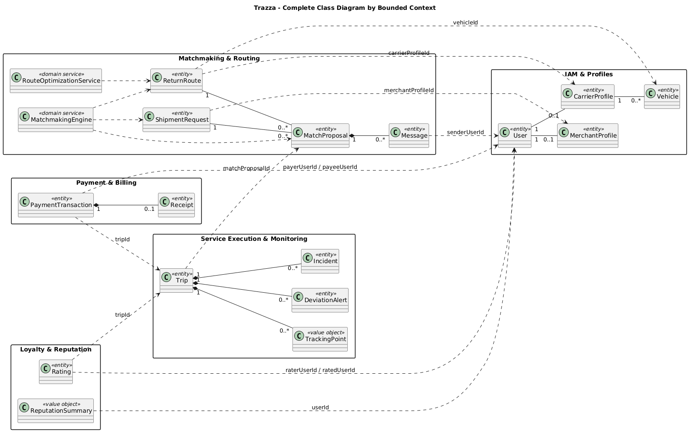
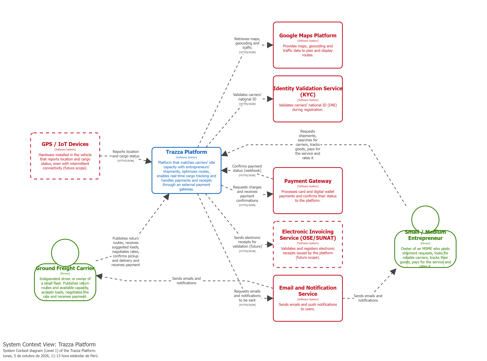

## 4.7. Software Object-Oriented Design

En esta sección se presenta el diseño orientado a objetos de Trazza, considerando los principios de Domain-Driven Design (DDD) definidos para la arquitectura del sistema. El diseño de clases representa las principales entidades, objetos de valor, servicios y componentes de las capas Domain, Application, Infrastructure y Presentation.

La estructura del diseño se organiza de acuerdo con los bounded contexts identificados para la plataforma: IAM & Profiles, Matchmaking & Routing, Service Execution & Monitoring, Payment & Billing y Loyalty & Reputation. Esta organización permite mantener separadas las responsabilidades de cada contexto y representar las relaciones existentes entre los principales elementos del dominio.

Asimismo, se presenta el Class Dictionary, donde se detallan los atributos, tipos de datos, métodos y responsabilidades de las principales clases del sistema.

### 4.7.1. Class Diagrams

**IAM & Profiles** 

**Matchmaking & Routing** 

**Service Execution & Monitoring** 

**Payment & Billing**  

**Loyalty & Reputation**

### 4.7.2. Class Dictionary