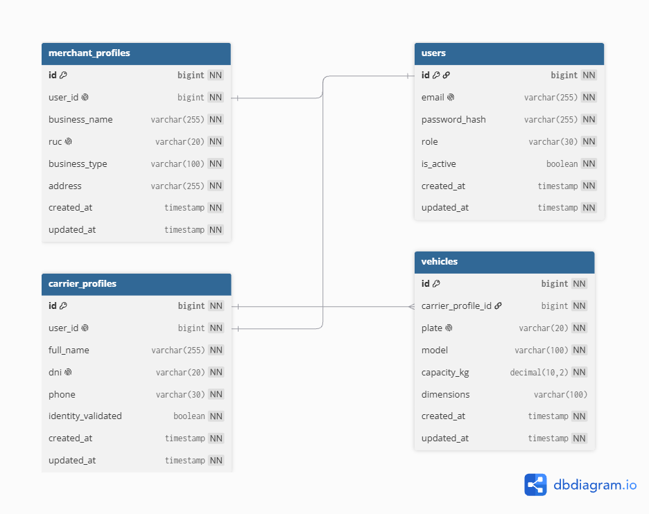
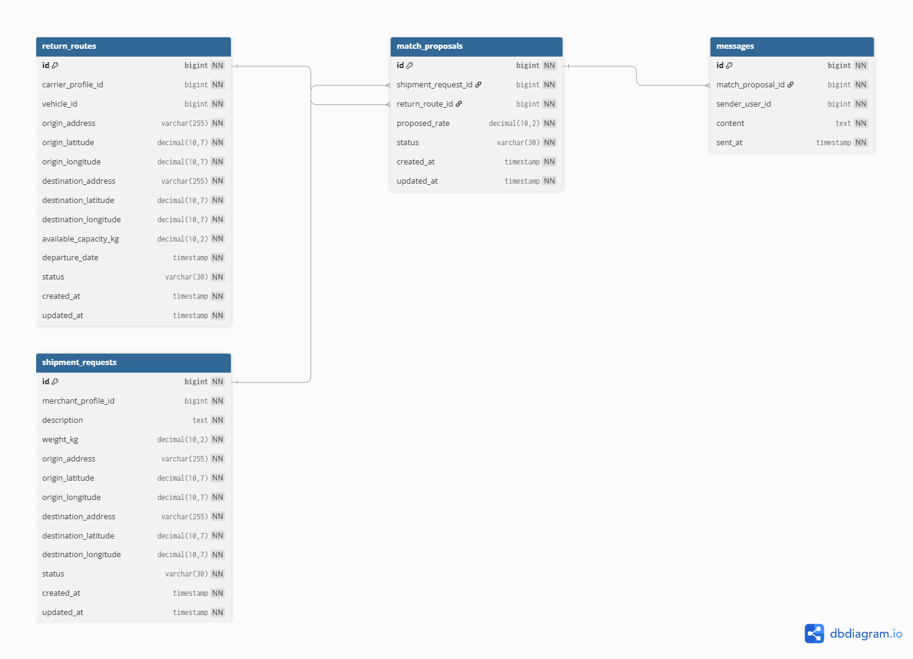
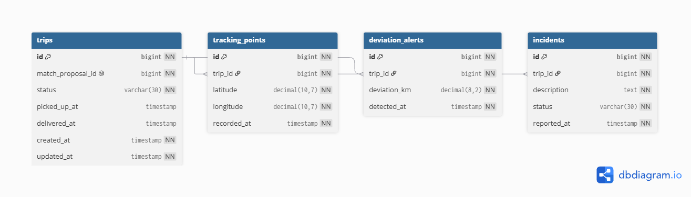
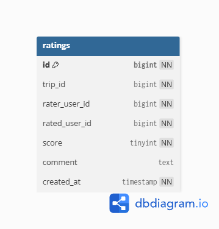

# 4.8. Database Design

El diseño de base de datos de Trazza define la estructura utilizada para almacenar y relacionar la información generada por los principales procesos de la plataforma. La base de datos se encuentra organizada de acuerdo con los Bounded Contexts identificados mediante Domain-Driven Design (DDD), permitiendo mantener una separación lógica entre las responsabilidades de cada dominio.

Para la persistencia de la información se plantea el uso de MySQL. El modelo considera las entidades que requieren almacenamiento permanente, sus claves primarias y foráneas, restricciones e índices necesarios para mantener la integridad y facilitar la consulta de los datos.

El diseño se divide en los siguientes Bounded Contexts: **IAM & Profiles**, **Matchmaking & Routing**, **Service Execution & Monitoring**, **Loyalty & Reputation** y **Payment & Billing**.

## 4.8.1. Entity-Relationship Diagram (ERD)

el diagrama completo de base de datos de Trazza integra las tablas pertenecientes a todos los Bounded Contexts y permite visualizar las relaciones necesarias para soportar el flujo principal de la plataforma.

El flujo de información comienza con los usuarios y sus respectivos perfiles. Los transportistas pueden registrar vehículos y publicar rutas de retorno, mientras que los emprendedores pueden registrar solicitudes de envío. Las coincidencias entre ambos elementos generan propuestas de negociación que, al ser aceptadas, permiten iniciar un viaje logístico.

Durante el viaje se registran datos de seguimiento, posibles desviaciones e incidencias. Una vez realizado el servicio, el sistema puede gestionar la transacción de pago correspondiente y permitir que los participantes registren sus respectivas calificaciones.

Esta organización mantiene una separación lógica entre los distintos dominios de Trazza y, al mismo tiempo, utiliza claves foráneas para conservar la integridad referencial entre los datos que participan en procesos que atraviesan más de un Bounded Context.

A continuación, explicamos de forma sencilla cómo está organizada nuestra base de datos:

**1. IAM & Profiles**

El Bounded Context **IAM & Profiles** almacena la información necesaria para identificar a los usuarios y administrar sus perfiles dentro de la plataforma. La tabla `users` centraliza la información utilizada para la autenticación y determina el rol del usuario dentro de Trazza.

Dependiendo del rol, un usuario puede disponer de un `carrier_profile` o un `merchant_profile`. Los transportistas pueden registrar uno o más vehículos mediante la tabla `vehicles`, los cuales posteriormente pueden ser utilizados para publicar rutas de retorno.

**2. Matchmaking & Routing**

El Bounded Context **Matchmaking & Routing** almacena la información relacionada con la publicación de rutas de retorno, las solicitudes de envío y el proceso de negociación entre transportistas y emprendedores.

La tabla `return_routes` registra las rutas publicadas por los transportistas y el vehículo asignado a cada una de ellas. Por su parte, `shipment_requests` almacena las solicitudes de transporte realizadas por los emprendedores.

La relación entre una solicitud de envío y una ruta disponible se representa mediante `match_proposals`, donde se registra la tarifa propuesta y el estado de la negociación. Asimismo, `messages` permite almacenar los mensajes intercambiados por los usuarios durante dicha negociación.

**3. Service Execution & Monitoring**

El Bounded Context **Service Execution & Monitoring** almacena la información correspondiente a la ejecución y seguimiento de los servicios logísticos que han sido acordados entre los usuarios.

La tabla `trips` representa el viaje logístico generado a partir de una propuesta aceptada. Cada viaje mantiene información sobre su estado y los momentos en los que se realiza el recojo y la entrega de la carga.

Durante la ejecución del servicio, `tracking_points` almacena los puntos de geolocalización registrados para el seguimiento del viaje. La tabla `deviation_alerts` registra las desviaciones detectadas respecto a la ruta esperada, mientras que `incidents` permite almacenar las incidencias reportadas durante el servicio.

**4. Payment & Billing**

El Bounded Context **Payment & Billing** almacena la información relacionada con los pagos efectuados por los servicios logísticos realizados mediante Trazza.

La tabla `payment_transactions` registra la transacción asociada a un viaje, identificando al usuario que realiza el pago, al usuario que lo recibe, el monto, la moneda, el método de pago y el estado de la operación. También permite almacenar el identificador externo generado por el proveedor de pagos.

Cuando una transacción genera un comprobante, este es almacenado mediante la tabla `receipts`, la cual mantiene una relación uno a uno con `payment_transactions`. De esta manera, la plataforma puede conservar la referencia del comprobante correspondiente a cada pago procesado.

**5. Loyalty & Reputation**

El Bounded Context **Loyalty & Reputation** gestiona la información utilizada para construir la reputación de los usuarios dentro de Trazza.

La tabla `ratings` registra las calificaciones realizadas después de un viaje, identificando el servicio asociado, el usuario que realiza la calificación y el usuario evaluado. También almacena la puntuación, el comentario y la fecha en que fue registrada.

Cada usuario puede realizar como máximo una calificación sobre otro participante por viaje. Los valores correspondientes al promedio de calificaciones y a la cantidad de evaluaciones son calculados a partir de los registros existentes en `ratings`, permitiendo construir el `ReputationSummary` utilizado por la aplicación sin duplicar esta información en una tabla independiente.

**Complete Trazza Database Diagram**

Finalmente, el diagrama completo de base de datos de Trazza integra las tablas pertenecientes a todos los Bounded Contexts y permite visualizar las relaciones necesarias para soportar el flujo principal de la plataforma.

El flujo de información comienza con los usuarios y sus respectivos perfiles. Los transportistas pueden registrar vehículos y publicar rutas de retorno, mientras que los emprendedores pueden registrar solicitudes de envío. Las coincidencias entre ambos elementos generan propuestas de negociación que, al ser aceptadas, permiten iniciar un viaje logístico.

Durante el viaje se registran datos de seguimiento, posibles desviaciones e incidencias. Una vez realizado el servicio, el sistema puede gestionar la transacción de pago correspondiente y permitir que los participantes registren sus respectivas calificaciones.

Esta organización mantiene una separación lógica entre los distintos dominios de Trazza y, al mismo tiempo, utiliza claves foráneas para conservar la integridad referencial entre los datos que participan en procesos que atraviesan más de un Bounded Context.

> *Fuente: Elaboración propia. Ver **Anexo G – Diagrama de Base de Datos Completo** para el diagrama interactivo.*
