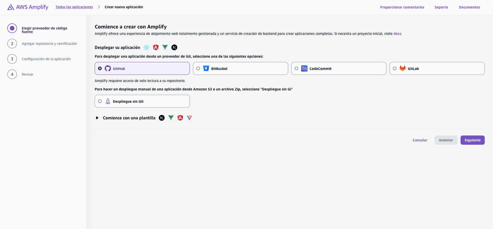
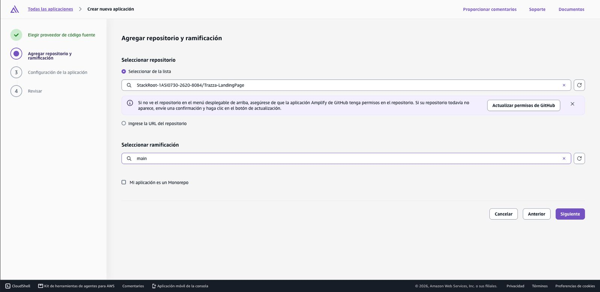
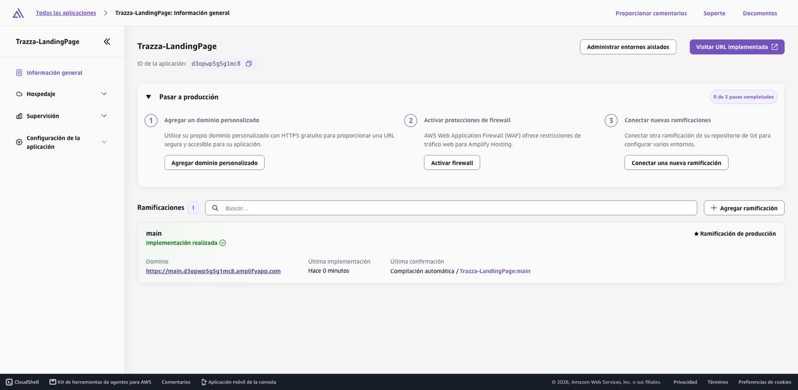
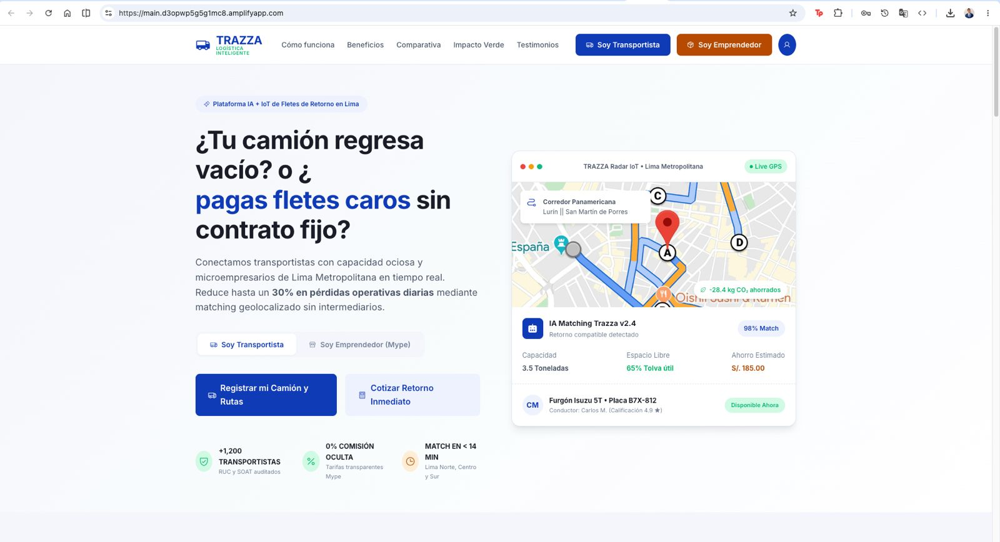
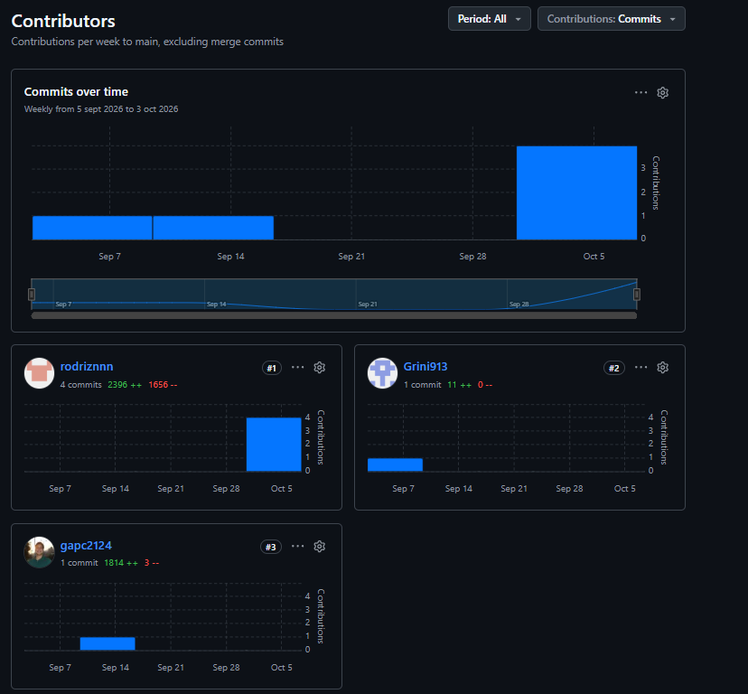
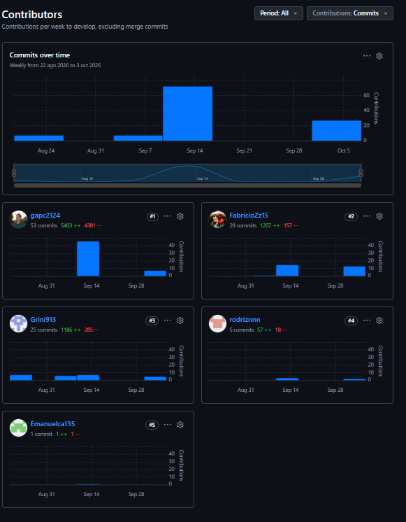
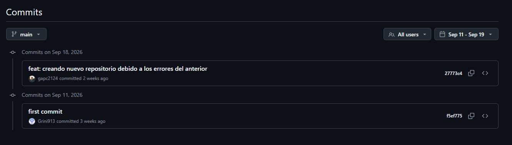
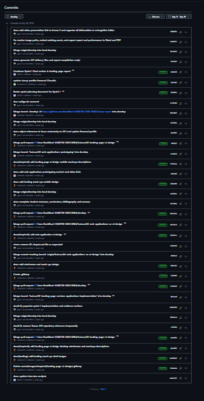

## 5.2. Landing Page, Services & Applications Implementation
 
En esta sección se explica y evidencia el proceso de implementación, pruebas, documentación y despliegue del Landing Page, los Web Services y la Frontend Web Application de Trazza, organizado por Sprint. En el Sprint 1 el equipo implementó y desplegó la primera versión del Landing Page. En el Sprint 2 se publicó una nueva versión del Landing Page y se planificó la primera versión de la Web Application a partir de los diseños de la sección 4.4.
 
### 5.2.1. Sprint 1
 
En esta sección se registra el avance en producto y en trabajo colaborativo del Sprint 1, cuyo alcance fue la primera versión del Landing Page, primer punto de contacto de Trazza con transportistas y comerciantes MYPE.
 
#### 5.2.1.1. Sprint Planning 1
 
En el Sprint Planning 1 el equipo definió el objetivo del Sprint y seleccionó las User Stories del Landing Page con mayor prioridad en el Product Backlog.
 
| Sprint # | Sprint 1 |
| :--- | :--- |
| **Sprint Planning Background** | |
| Date | 2026-09-18 |
| Time | 10:00 AM |
| Location | Reunión virtual vía Microsoft Teams |
| Prepared By | Peñaranda Caldas, Gabriel Augusto |
| Attendees (to planning meeting) | Checalla Apaza, Emanuel Renato / Lozano Quispe, Fabricio Jofred / Medina Merma, Ingrid Melani / Peñaranda Caldas, Gabriel Augusto / Vite Celis, Rodrigo Matias |
| Sprint 0 Review Summary | N/A. Es el primer Sprint del proyecto. |
| Sprint 0 Retrospective Summary | N/A. Es el primer Sprint del proyecto. |
| **Sprint Goal & User Stories** | |
| Sprint 1 Goal | **Nuestro enfoque está en** publicar la primera versión del Landing Page de Trazza, que presente la propuesta de valor para transportistas con viajes de retorno vacíos y para comerciantes MYPE que necesitan enviar mercadería por Lima. **Creemos que esto entrega** una primera razón clara para registrarse **a** transportistas independientes y comerciantes MYPE de Lima. **Esto se confirmará cuando** un visitante pueda abrir el Landing Page desde una URL pública, identificar la propuesta para su segmento, leer los testimonios y llegar al formulario de registro de su rol. |
| Sprint 1 Velocity | 5 Story Points |
| Sum of Story Points | 5 Story Points (US04: 2, US05: 2, US25: 1) |
 
#### 5.2.1.2. Aspect Leaders and Collaborators
 
Los aspectos del Sprint 1 son la implementación del Landing Page, el diseño de sus wireframes y mock-ups (sección 4.3) y su despliegue. Los líderes se asignaron según la participación registrada en los repositorios.
 
| Team Member (Last Name, First Name) | GitHub Username | Landing Page Implementation (L/C) | Landing Page UI Design (L/C) | Landing Page Deployment (L/C) |
| :--- | :--- | :---: | :---: | :---: |
| Checalla Apaza, Emanuel Renato | Emanuelca135 | C | C | L |
| Lozano Quispe, Fabricio Jofred | FabricioZz15 | C | L | C |
| Medina Merma, Ingrid Melani | Grini913 | C | C | C |
| Peñaranda Caldas, Gabriel Augusto | gapc2124 | L | C | C |
| Vite Celis, Rodrigo Matias | rodriznnn | C | C | C |
 
#### 5.2.1.3. Sprint Backlog 1
 
El objetivo del Sprint 1 fue publicar la primera versión del Landing Page. Las User Stories se descompusieron en tareas de 4 a 8 horas.
 
> **Pendiente:** screenshot del tablero de YouTrack filtrado por el Sprint 1. La imagen `chapter3/product-backlog-1.jpeg` muestra el Product Backlog completo sin Sprint asignado ("No programada"), por lo que no sirve como tablero del Sprint.
 
**URL público del Board:** [https://trazza.youtrack.cloud/agiles/204-1/current](https://trazza.youtrack.cloud/agiles/204-1/current)
 
| Sprint # | Sprint 1 | | | | | | |
| :--- | :--- | :--- | :--- | :--- | :--- | :--- | :--- |
| **User Story** | | **Work-Item / Task** | | | | | |
| **Id** | **Title** | **Id** | **Title** | **Description** | **Estimation (Hours)** | **Assigned To** | **Status** |
| US04 | Landing Page: Propuesta para Transportistas | T01 | Estructura base del repositorio | Crear el repositorio `Trazza-LandingPage` y la estructura inicial del sitio. | 4 | Medina Merma, Ingrid Melani | Done |
| US04 | Landing Page: Propuesta para Transportistas | T02 | Header, navegación y Hero | Implementar la barra de navegación responsive y la sección Hero con los botones por rol. | 6 | Peñaranda Caldas, Gabriel Augusto | Done |
| US04 | Landing Page: Propuesta para Transportistas | T03 | Sección para transportistas | Maquetar los beneficios para el transportista y el llamado a registrarse. | 4 | Peñaranda Caldas, Gabriel Augusto | Done |
| US05 | Landing Page: Propuesta para Emprendedores | T04 | Sección para comerciantes y comparativa | Maquetar los beneficios para el comerciante MYPE y la comparativa frente al flete tradicional. | 5 | Peñaranda Caldas, Gabriel Augusto | Done |
| US25 | Landing Page: Testimonios de Éxito | T05 | Testimonios y footer | Implementar las tarjetas de testimonios, la sección de contacto y el footer. | 4 | Peñaranda Caldas, Gabriel Augusto | Done |
| — | Constraint: despliegue | T06 | Despliegue en AWS Amplify | Conectar el repositorio con AWS Amplify, publicar la rama `main` y validar la URL pública. | 4 | Checalla Apaza, Emanuel Renato | Done |
 
#### 5.2.1.4. Development Evidence for Sprint Review
 
En el Sprint 1 se creó el repositorio del Landing Page y se implementó su primera versión, que luego se publicó en AWS Amplify. En paralelo se documentaron en el informe el diseño del Landing Page y la configuración del proyecto. La siguiente tabla muestra los commits relacionados con la implementación.
 
| Repository | Branch | Commit Id | Commit Message | Commit Message Body | Committed on (Date) |
| :--- | :--- | :--- | :--- | :--- | :--- |
| StackRoot-1ASI0730-2620-8084/Trazza-LandingPage | main | f5ef775 | first commit | - | 2026-09-11 |
| StackRoot-1ASI0730-2620-8084/Trazza-LandingPage | main | 27773c4 | feat: creando nuevo repositorio debido a los errores del anterior | - | 2026-09-18 |
| StackRoot-1ASI0730-2620-8084/Trazza-report | feature/43-landing-page-ui-design | 11323a7 | docs(landing): add landing wireframes images | - | 2026-09-18 |
| StackRoot-1ASI0730-2620-8084/Trazza-report | feature/43-landing-page-ui-design | be862b6 | docs(landing): add landing mock ups desk images | - | 2026-09-18 |
| StackRoot-1ASI0730-2620-8084/Trazza-report | feature/43-landing-page-ui-design | a05df02 | docs(chapter4): add landing page ui design desktop wireframes and mockups descriptions | - | 2026-09-18 |
| StackRoot-1ASI0730-2620-8084/Trazza-report | feature/51-software-configuration-management | 78675b9 | doc(5.1): add complete content for software configuration management | - | 2026-09-18 |
| StackRoot-1ASI0730-2620-8084/Trazza-report | feature/52-landing-page-services-applications-implementation | 84eb2d8 | doc(5.2): populate sprint 1 implementation and evidence sections | - | 2026-09-18 |
 
#### 5.2.1.5. Execution Evidence for Sprint Review
 
Al cierre del Sprint 1, el Landing Page quedó publicado en una URL pública. Presentaba la propuesta de valor para ambos segmentos, la comparativa frente al flete tradicional, los testimonios y los accesos al registro por rol.
 

  
    
  
    
  

> **Pendiente:** URL del video de navegación del Sprint 1 en Microsoft Stream.
 
#### 5.2.1.6. Services Documentation Evidence for Sprint Review
 
El alcance del Sprint 1 se limitó al Landing Page, que es un sitio estático. Por ello, en este Sprint no se implementaron ni documentaron endpoints con OpenAPI. Los Web Services de Trazza se implementarán en ASP.NET Core en un Sprint posterior.
 
#### 5.2.1.7. Software Deployment Evidence for Sprint Review
 
En el Sprint 1 se creó la aplicación en AWS Amplify Hosting y se conectó con la rama `main` del repositorio `Trazza-LandingPage`, siguiendo los pasos descritos en la sección 5.1.4. Al ser un sitio estático, no requiere comando de build. Desde entonces, cada cambio integrado en `main` se publica automáticamente.
 
**URL del Landing Page:** [https://main.d3opwp5g5g1mc8.amplifyapp.com](https://main.d3opwp5g5g1mc8.amplifyapp.com)
 

  

#### 5.2.1.8. Team Collaboration Insights during Sprint
 
En el Sprint 1 el equipo trabajó en dos repositorios. En `Trazza-LandingPage` se registraron 2 commits: Medina Merma, Ingrid Melani (estructura inicial) y Peñaranda Caldas, Gabriel Augusto (primera versión completa), ambos directamente en `main`. En `Trazza-report` cada sección del informe se trabajó en su rama `feature/*` y se integró a `develop` mediante Pull Requests, con commits de los cinco integrantes.
 
Los gráficos de Contributors muestran las contribuciones semanales de cada integrante. Las barras de las semanas del 7 y 14 de septiembre corresponden al Sprint 1.
 

  
    
  
    
  
    
  

