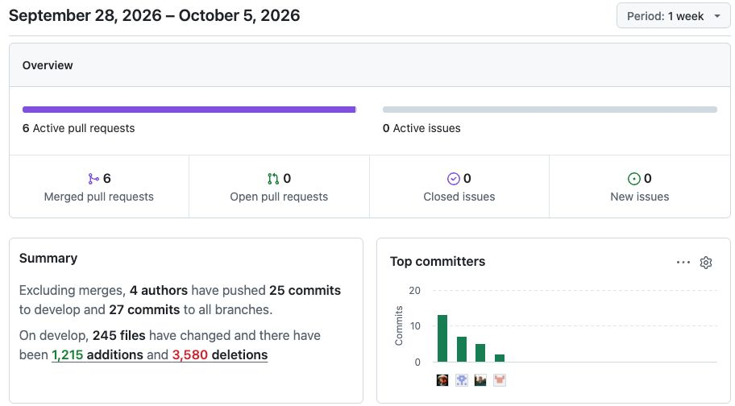
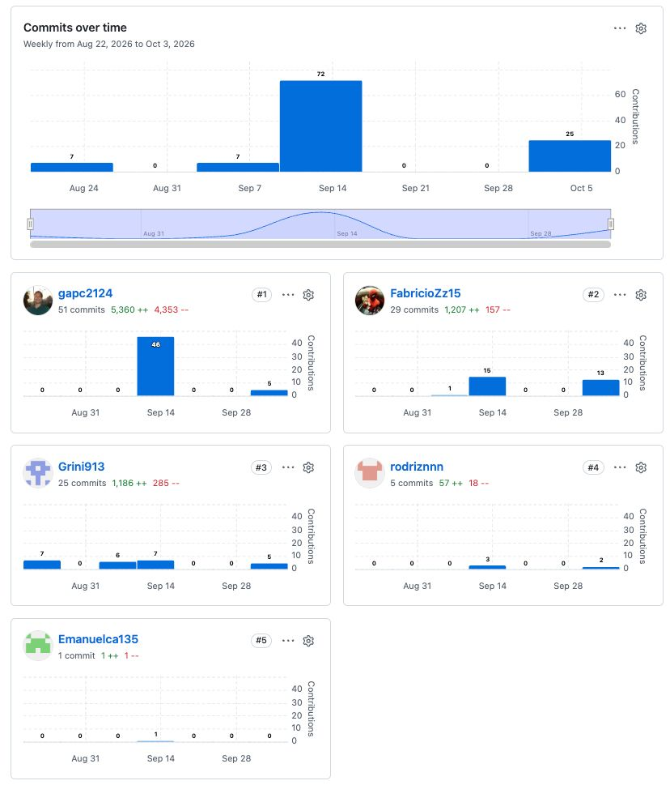

## Project Report Collaboration Insights

**URL del repositorio para el reporte del proyecto:** https://github.com/StackRoot-1ASI0730-2620-8084/Trazza-report

GitHub Collaboration Insights proporciona un cronograma que muestra las principales ramas y los procesos de fusión que han ocurrido. Todas las ramas se han generado siguiendo los principios de GitFlow, lo que garantiza una organización efectiva al utilizar un sistema de control de versiones.

* Emanuel Renato Checalla Apaza (Emanuelca135)
* Fabricio Jofred Lozano Quispe (FabricioZz15)
* Gabriel Augusto Peñaranda Caldas (gapc2024)
* Ingrid Melani Medina Merma (Grini913)
* Rodrigo Matias Vite Celis (rodriznnn)

Se dividieron las siguientes ramas para la colaboración en el proyecto:

* `main`
* `develop`
* `feature/11-startup-profile`
* `feature/12-solution-profile`
* `feature/13-segmentos-objetivo`
* `feature/21-competidores`
* `feature/22-entrevistas`
* `feature/23-needfinding`
* `feature/24-event-storming`
* `feature/25-ubiquitous-language`
* `feature/31-user-stories`
* `feature/32-impact-mapping`
* `feature/33-product-backlog`
* `feature/41-style-guidelines`
* `feature/42-information-architecture`
* `feature/43-landing-page-ui-design`
* `feature/44-web-applications-ux-ui-design`
* `feature/45-web-applications-prototyping`
* `feature/46-domain-driven-software-architecture`
* `feature/47-software-object-oriented-design`
* `feature/48-database-design`
* `feature/51-software-configuration-management`
* `feature/52-landing-page-services-applications-implementation`

### Entrega 1 - AV1
#### Versión 1.0 (06/09/2026) y Versión 1.1 (13/09/2026)

Durante la primera entrega, el equipo se centró en la elaboración y culminación del Capítulo 1 del informe. Las actividades se desarrollaron de manera colaborativa; nos dividimos las tareas de investigación y redacción de las secciones iniciales para garantizar la participación equitativa de todos los miembros. El trabajo se integró en el repositorio utilizando la estrategia Gitflow, realizando *commits* frecuentes y descriptivos en las ramas correspondientes antes de integrarlos a `develop`.

### Entregable TRABAJO PARCIAL (TB1)

A continuación, explicamos y detallamos las analíticas de colaboración en base a lo obtenido de GitHub Insights para la entrega del Trabajo Parcial (TB1). Hemos colocado en el siguiente orden las imágenes correspondientes a: **Pulse**, **Contributors**, **Traffic** y **Network Graph**.

  <h4>1. Pulse</h4>
  
    

  <h4>2. Contributors</h4>
  
    

  <h4>3. Traffic</h4>
  
    

  <h4>4. Network Graph</h4>
  

